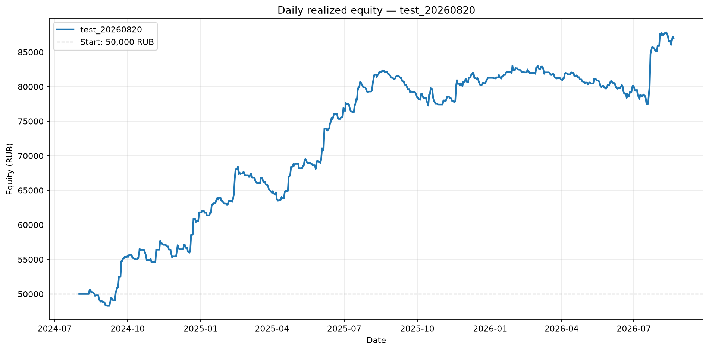
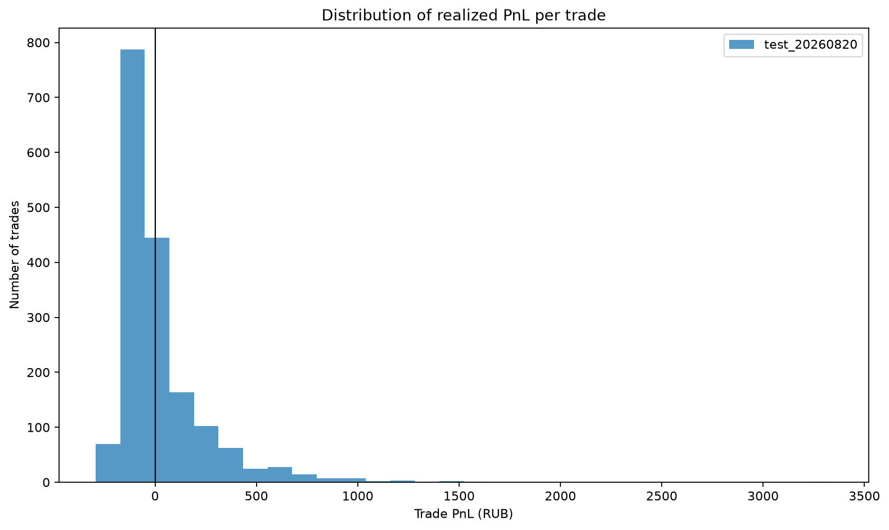
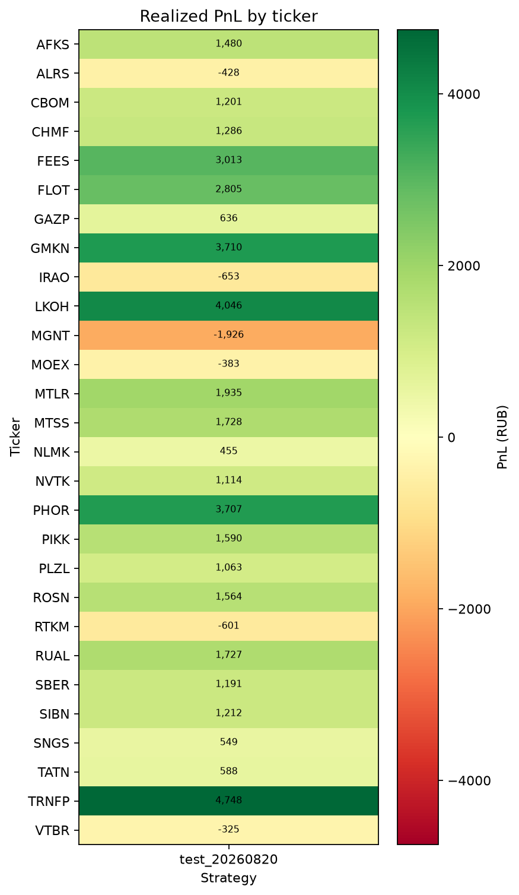
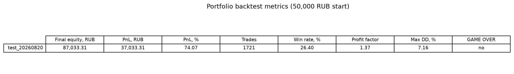

# Issue #100: портфельный бэктест test_20260820

## Резюме

Один конфиг: **test_20260820** (`trading.strategies.id=102`),
плагин `levels_reversal`. На общем капитале 50,000 RUB итоговый equity
87,033.31 RUB (+37,033.31 RUB, +74.07%).
Это исторический бэктест и не доказывает будущую доходность.

**Вердикт для продукта:** По правилам #44 ограниченный forward paper **допустим** (PnL +37,033.31 RUB, PF 1.37, n=1721, без GAME OVER; daily Max DD 7.16%). Параметры `test_20260820` и locked `test_20260731` не менять.

## Подтверждение конфига id=102

- Имя / id: `test_20260820` / `102`.
- Paper / locked: `in_paper_test=false`,
  `locked=false`. Locked `test_20260731` (id=36)
  не читался и не записывался (`locked_reference_id_untouched=36`).
- Plugin: `levels_reversal` (`config.strategy_name` / `resolve_strategy_name`).
- Паттерны: `signal_4h_buy, levels_reversal`.
- Уровни: `level_method=['swing']`,
  `swing_window=10`,
  `zone_atr_mult=0.5`,
  `level_timeframe=4h`.
- Confirm / RR: `[10]`,
  RR 1:2,
  commission 0.06%,
  slippage 0,
  n_runs `1`.
- Период: `2024-08-01` — `2026-08-20` (запрос `timestamp < 2026-08-21`,
  exclusive-конвенция `MODE_PRESETS`; #44 заканчивался exclusive `2026-08-15`).
- Вселенная: `get_tickers_by_volume(..., max_tickers=None)`, порядок = рейтинг объёма.
- Тикеры в volume-order: `FEES, IRAO, AFKS, VTBR, GAZP, SNGS, SBER, RUAL, ALRS, GMKN, MTLR, CBOM, NLMK, ROSN, RTKM, MOEX, FLOT, MTSS, NVTK, PIKK, TATN, CHMF, SIBN, PLZL, LKOH, TRNFP, MGNT, PHOR`.
- Не загружены: нет.
- SHA-256 входного JSON: `5c28630f926bfa0c745d8d0c8d6b8fce6d17269998e6553a2c95d7cf8057b41d`.

## Методика

- Движок: `run_portfolio_backtest` → `LevelsReversalStrategy` → `StrategyEvaluator`
  **после** #97 (вето resistance-зоны включено).
- Капитал 50,000 RUB; слот 10,000 RUB; максимум 5 позиций.
- Конкуренция: статический volume rank; нет слота → skip (`skipped_entries_no_slot`).
- Комиссия уже в `net_return_pct`.
- Equity по дням — по закрытым сделкам, без mark-to-market.
- Max DD в таблице — по equity на конец дня; event-based Max DD симулятора отдельно.
- Lab express / full-sample по 28 тикерам и сравнение с ATR в этот отчёт не входят.

## Портфельные метрики

| Стратегия | Итоговый equity, RUB | PnL, RUB | PnL, % | Сделки | Win rate | Profit factor | Max DD | GAME OVER |
|---|---:|---:|---:|---:|---:|---:|---:|:---:|
| test_20260820 | 87,033.31 | +37,033.31 | +74.07% | 1721 | 26.4% | 1.37 | 7.16% | нет |

- skipped no-slot: `843`.
- candidate trades до replay: `2564`.

### Максимальная просадка

- Daily Max DD: 7.16% с 2025-02-17
  по 2025-04-08; equity снизилась с
  68,428.30 до
  63,526.04 RUB
  (−4,902.26 RUB).
- Event-based Max DD симулятора: 7.72%.

## Анализ сделок и тикеров

- **Больше всего сделок:** FLOT (115 сделок), IRAO (101 сделок), SIBN (95 сделок), CBOM (89 сделок), SNGS (87 сделок).
- **Прибыльные:** TRNFP (+4,748 RUB, 17 сделок), LKOH (+4,046 RUB, 65 сделок), GMKN (+3,710 RUB, 35 сделок), PHOR (+3,707 RUB, 47 сделок), FEES (+3,013 RUB, 52 сделок).
- **Убыточные:** MGNT (-1,926 RUB, 59 сделок), IRAO (-653 RUB, 101 сделок), RTKM (-601 RUB, 61 сделок), ALRS (-428 RUB, 76 сделок), MOEX (-383 RUB, 70 сделок).

## Анализ по месяцам

- Прибыльные месяцы — 2024-09, 2024-11, 2024-12, 2025-01, 2025-02, 2025-04, 2025-05, 2025-06, 2025-07, 2025-08, 2025-11, 2025-12, 2026-01, 2026-02, 2026-07, 2026-08; убыточные — 2024-08, 2024-10, 2025-03, 2025-09, 2025-10, 2026-03, 2026-04, 2026-05, 2026-06.

## Точечная проверка ALRS (paper #711)

Бар `2026-08-20 11:50:24` @ 19.80 **не** найден ни среди per-ticker candidate entries, ни среди портфельных сделок. Вето #97 на этом баре сработало.

## GAME OVER

GAME OVER не наступил.

## Рекомендации

1. По правилам #44 ограниченный forward paper **допустим** (PnL +37,033.31 RUB, PF 1.37, n=1721, без GAME OVER; daily Max DD 7.16%). Параметры `test_20260820` и locked `test_20260731` не менять.
2. Не подменять этот портфельный прогон Lab UI (`full_sample` express) и не считать
   его достаточным.
3. Не сужать вселенную до ALRS / live top-5 и не крутить RR / confirm / `level_method`.
4. Следующая итерация по правилам #44: mark-to-market equity и walk-forward, если
   продукт снова рассматривает paper.

## Контекст Issue #44 (другой конфиг, не сравнение)

Исторический пакет `analytics/issue-44-strategy-comparison/`: locked
`test_20260731` id=36, `level_method=['swing','impulse']`, exclusive
`date_to=2026-08-15`, движок **до** вето #97. Levels reversal тогда:
equity 96,343.49 RUB,
PnL +46,343.49 RUB (+92.69%),
3500 сделок, WR 28.3%,
PF 1.31, daily Max DD
5.47%. Цифры даны только как фон; это
другой конфиг и другой `date_to`. ATR в этом отчёте не сравнивается.

## Воспроизводимость

- Входной JSON SHA-256: `5c28630f926bfa0c745d8d0c8d6b8fce6d17269998e6553a2c95d7cf8057b41d`
- Код расчётов: `analysis.py`; интерактивный walkthrough: `analysis.ipynb`.

