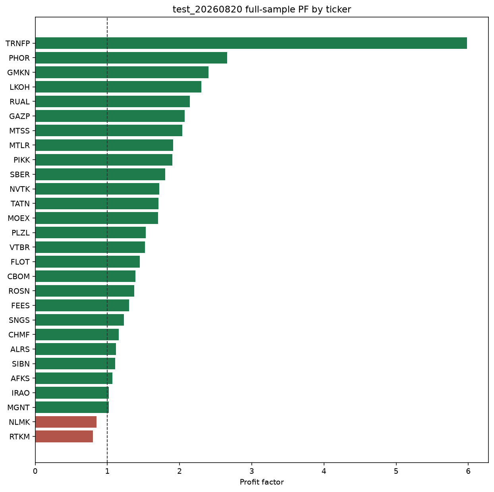
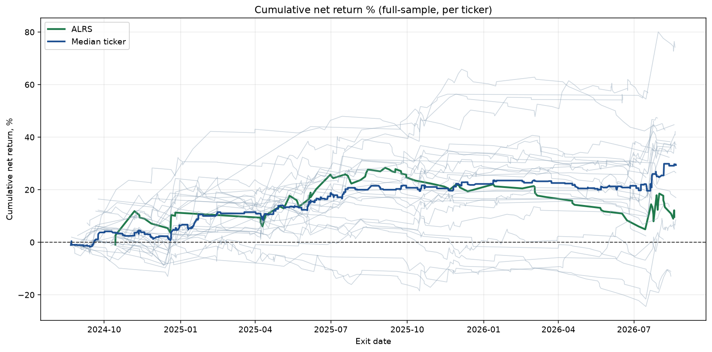
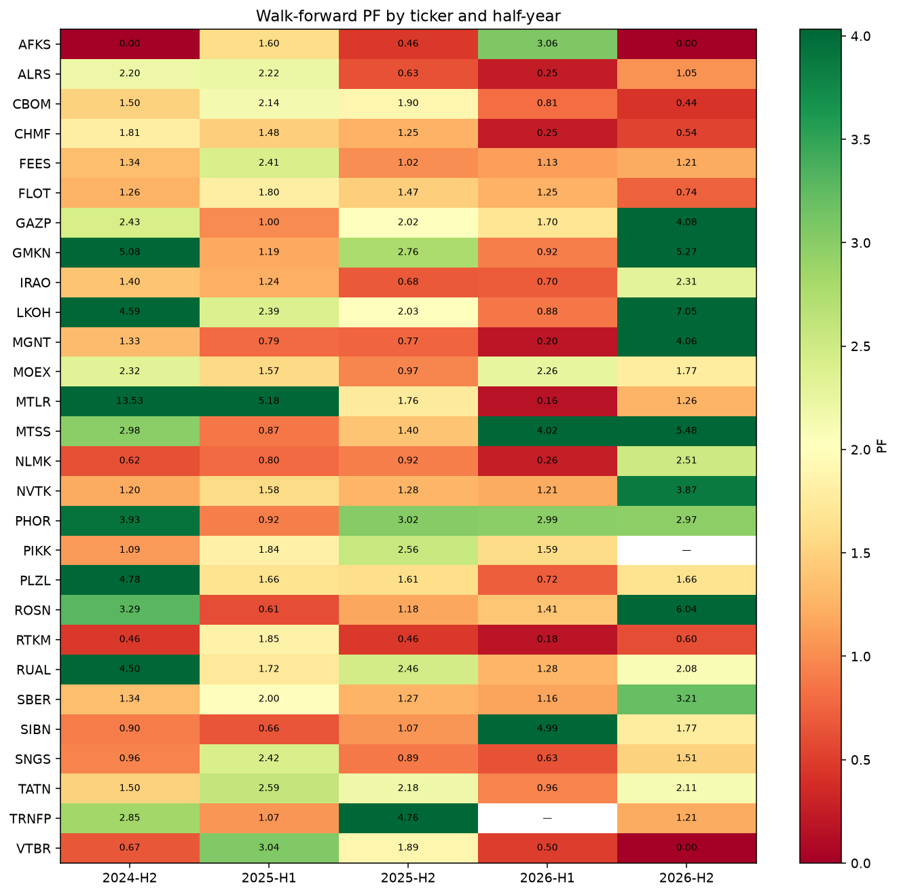

# Issue #100: бэктест `test_20260820` после вето зоны сопротивления

## Резюме

Прогнан **только** Lab-конфиг `test_20260820` (id=102) на текущем `StrategyEvaluator` после мержа #97.
Вселенная — `get_big_tickers(min_candles=250000)`: **28** тикеров. Черновик Lab `run_params.tickers=['AFKS', 'ALRS', 'CBOM', 'CHMF', 'FEES', 'FLOT', 'GAZP', 'GMKN', 'IRAO', 'LKOH', 'MGNT', 'MOEX', 'MTLR', 'MTSS', 'NLMK', 'NVTK', 'PHOR', 'PIKK', 'PLZL', 'ROSN', 'RTKM', 'RUAL', 'SBER', 'SIBN', 'SNGS', 'TATN', 'TRNFP', 'VTBR']` проигнорирован.
Стратегия **не** lock/paper-flagged этим отчётом; locked `test_20260731` не перезаписывался.

Вердикт: **кандидат на paper на полной Lab-вселенной**.

## Подтверждение конфига

- Снимок: `2026-08-21 03:09:24`.
- id=102, name=`test_20260820`, `in_paper_test=False`, `locked=False`.
- Паттерны: `signal_4h_buy, levels_reversal`.
- Уровни: `level_method=['swing']`, `swing_window=10`, `zone_atr_mult=0.5`, `level_timeframe=4h`.
- Confirm / RR: confirm `[10]`, RR `{'risk': 1, 'reward': 2}`, commission `0.06%`, slippage `0`.
- Движок: `run_strategy_backtest`, `n_runs=1` (детерминированный прогон).
- Full-sample окно: `2024-08-21` → конец доступных 1min (`max_1min_ts=2026-08-20 22:05:00`).
- Фактический список тикеров: `AFKS, ALRS, CBOM, CHMF, FEES, FLOT, GAZP, GMKN, IRAO, LKOH, MGNT, MOEX, MTLR, MTSS, NLMK, NVTK, PHOR, PIKK, PLZL, ROSN, RTKM, RUAL, SBER, SIBN, SNGS, TATN, TRNFP, VTBR`.

Флаги стратегий на старте прогона:

- `test_20260731` (id=36): in_paper_test=True, locked=True
- `test_20260820` (id=102): in_paper_test=False, locked=False

## Full-sample

Агрегаты: median PF `1.52`, mean PF `1.72`, доля PF>1 `0.929` (26/28), сделок `2556`, median WR `28.6%`, median MaxDD `13.1%`.

| Ticker | status | n | PF | Exp % | WR | MaxDD % |
|---|---|---:|---:|---:|---:|---:|
| AFKS | success | 45 | 1.07 | 0.053 | 28.9 | 9.7 |
| ALRS | success | 111 | 1.12 | 0.087 | 23.4 | 23.4 |
| CBOM | success | 123 | 1.39 | 0.211 | 27.6 | 13.2 |
| CHMF | success | 117 | 1.16 | 0.116 | 21.4 | 21.0 |
| FEES | success | 82 | 1.30 | 0.207 | 23.2 | 10.7 |
| FLOT | success | 142 | 1.45 | 0.247 | 23.9 | 14.4 |
| GAZP | success | 57 | 2.07 | 0.625 | 31.6 | 8.5 |
| GMKN | success | 56 | 2.40 | 0.820 | 35.7 | 10.8 |
| IRAO | success | 129 | 1.02 | 0.008 | 26.4 | 15.7 |
| LKOH | success | 88 | 2.30 | 0.537 | 29.5 | 8.0 |
| MGNT | success | 102 | 1.02 | 0.013 | 21.6 | 32.9 |
| MOEX | success | 105 | 1.70 | 0.364 | 30.5 | 8.2 |
| MTLR | success | 59 | 1.91 | 0.758 | 32.2 | 23.6 |
| MTSS | success | 75 | 2.04 | 0.562 | 33.3 | 6.2 |
| NLMK | success | 105 | 0.85 | -0.106 | 23.8 | 25.0 |
| NVTK | success | 82 | 1.72 | 0.462 | 29.3 | 11.9 |
| PHOR | success | 69 | 2.66 | 0.619 | 37.7 | 5.3 |
| PIKK | success | 73 | 1.90 | 0.742 | 27.4 | 11.7 |
| PLZL | success | 100 | 1.53 | 0.323 | 29.0 | 14.5 |
| ROSN | success | 104 | 1.37 | 0.221 | 25.0 | 16.4 |
| RTKM | success | 83 | 0.80 | -0.156 | 19.3 | 24.4 |
| RUAL | success | 100 | 2.14 | 0.742 | 34.0 | 8.6 |
| SBER | success | 93 | 1.80 | 0.284 | 33.3 | 6.0 |
| SIBN | success | 121 | 1.11 | 0.071 | 24.8 | 18.5 |
| SNGS | success | 128 | 1.23 | 0.110 | 25.0 | 14.5 |
| TATN | success | 102 | 1.71 | 0.364 | 31.4 | 13.0 |
| TRNFP | success | 31 | 5.98 | 1.834 | 41.9 | 3.7 |
| VTBR | success | 74 | 1.52 | 0.333 | 28.4 | 14.6 |

## Walk-forward

Периоды: 2024-H2, 2025-H1, 2025-H2, 2026-H1, 2026-H2. По наблюдениям PF: PF>1 = 97/138, min PF `0.0`, avg PF `1.91`.

| Ticker | 2024-H2 | 2025-H1 | 2025-H2 | 2026-H1 | 2026-H2 | PF>1 | min PF | avg PF |
|---|---|---|---|---|---|---|---|---|
| AFKS | 0.00 | 1.60 | 0.46 | 3.06 | 0.00 | 2/5 | 0.00 | 1.02 |
| ALRS | 2.20 | 2.22 | 0.63 | 0.25 | 1.05 | 3/5 | 0.25 | 1.27 |
| CBOM | 1.50 | 2.14 | 1.90 | 0.81 | 0.44 | 3/5 | 0.44 | 1.36 |
| CHMF | 1.81 | 1.48 | 1.25 | 0.25 | 0.54 | 3/5 | 0.25 | 1.07 |
| FEES | 1.34 | 2.41 | 1.02 | 1.13 | 1.21 | 5/5 | 1.02 | 1.42 |
| FLOT | 1.26 | 1.80 | 1.47 | 1.25 | 0.74 | 4/5 | 0.74 | 1.30 |
| GAZP | 2.43 | 1.00 | 2.02 | 1.70 | 4.08 | 4/5 | 1.00 | 2.25 |
| GMKN | 5.08 | 1.19 | 2.76 | 0.92 | 5.27 | 4/5 | 0.92 | 3.04 |
| IRAO | 1.40 | 1.24 | 0.68 | 0.70 | 2.31 | 3/5 | 0.68 | 1.27 |
| LKOH | 4.59 | 2.39 | 2.03 | 0.88 | 7.05 | 4/5 | 0.88 | 3.39 |
| MGNT | 1.33 | 0.79 | 0.77 | 0.20 | 4.06 | 2/5 | 0.20 | 1.43 |
| MOEX | 2.32 | 1.57 | 0.97 | 2.26 | 1.77 | 4/5 | 0.97 | 1.78 |
| MTLR | 13.53 | 5.18 | 1.76 | 0.16 | 1.26 | 4/5 | 0.16 | 4.38 |
| MTSS | 2.98 | 0.87 | 1.40 | 4.02 | 5.48 | 4/5 | 0.87 | 2.95 |
| NLMK | 0.62 | 0.80 | 0.92 | 0.26 | 2.51 | 1/5 | 0.26 | 1.02 |
| NVTK | 1.20 | 1.58 | 1.28 | 1.21 | 3.87 | 5/5 | 1.20 | 1.83 |
| PHOR | 3.93 | 0.92 | 3.02 | 2.99 | 2.97 | 4/5 | 0.92 | 2.77 |
| PIKK | 1.09 | 1.84 | 2.56 | 1.59 | — | 4/4 | 1.09 | 1.77 |
| PLZL | 4.78 | 1.66 | 1.61 | 0.72 | 1.66 | 4/5 | 0.72 | 2.09 |
| ROSN | 3.29 | 0.61 | 1.18 | 1.41 | 6.04 | 4/5 | 0.61 | 2.51 |
| RTKM | 0.46 | 1.85 | 0.46 | 0.18 | 0.60 | 1/5 | 0.18 | 0.71 |
| RUAL | 4.50 | 1.72 | 2.46 | 1.28 | 2.08 | 5/5 | 1.28 | 2.41 |
| SBER | 1.34 | 2.00 | 1.27 | 1.16 | 3.21 | 5/5 | 1.16 | 1.80 |
| SIBN | 0.90 | 0.66 | 1.07 | 4.99 | 1.77 | 3/5 | 0.66 | 1.88 |
| SNGS | 0.96 | 2.42 | 0.89 | 0.63 | 1.51 | 2/5 | 0.63 | 1.28 |
| TATN | 1.50 | 2.59 | 2.18 | 0.96 | 2.11 | 4/5 | 0.96 | 1.87 |
| TRNFP | 2.85 | 1.07 | 4.76 | — | 1.21 | 4/4 | 1.07 | 2.47 |
| VTBR | 0.67 | 3.04 | 1.89 | 0.50 | 0.00 | 2/5 | 0.00 | 1.22 |

## ALRS vs express Lab id=271

- полный прогон ALRS: n=111, PF=1.12, Exp%=0.087, WR=23.4%, MaxDD%=23.4
- текущий express ALRS в снимке: id=279 (express, ALRS): n=27, PF=0.93, Exp%=-0.079, WR=18.5, MaxDD%=9.6. id=271 в БД: нет (Lab DELETE+re-run); цифра из issue: n=25, PF=1.05. Issue #100 cited express Lab id=271 (ALRS-only, n=25, PF=1.05). Lab `_run_job` deletes previous backtest_results for the strategy, so that row is gone. The snapshot's ALRS express row is still short-window depth=express, not a 2-year full-universe baseline.

Полного 24-месячного baseline по всем тикерам в `trading.backtest_results` до этого прогона не было: более поздний Lab express покрывает те же 28 имён, но это короткое окно, не Very serious.

## Точечная проверка paper #711

Запрещённый бар: `2026-08-20 11:50:24` @ 19.8. В новом trade list: **нет (ok)**.
Сделки ALRS за 2026-08-20: нет сделок ALRS в этот день.

Это swing-only конфиг. Отсутствие входа не объясняется «особенностью swing-only», если бар всё же попал в список — тогда это блокер гарда #97.

## Вердикт для продукта

- метрики проходят консервативный бар кандидата на paper; этот PR не lock и не paper-flag

Параметры `test_20260820` и locked `test_20260731` этим issue **не крутились**. Следующий шаг — накопить forward paper на текущем locked конфиге и не подменять его этим прогоном без отдельного решения PO.

## Воспроизводимость

- Входы: `inputs.json` (срез стратегии и baseline без секретов).
- Прогон: `results.json` через `extract_inputs.py` → `run_strategy_backtest` / `run_walkforward`.
- Код: `analysis.py`.
