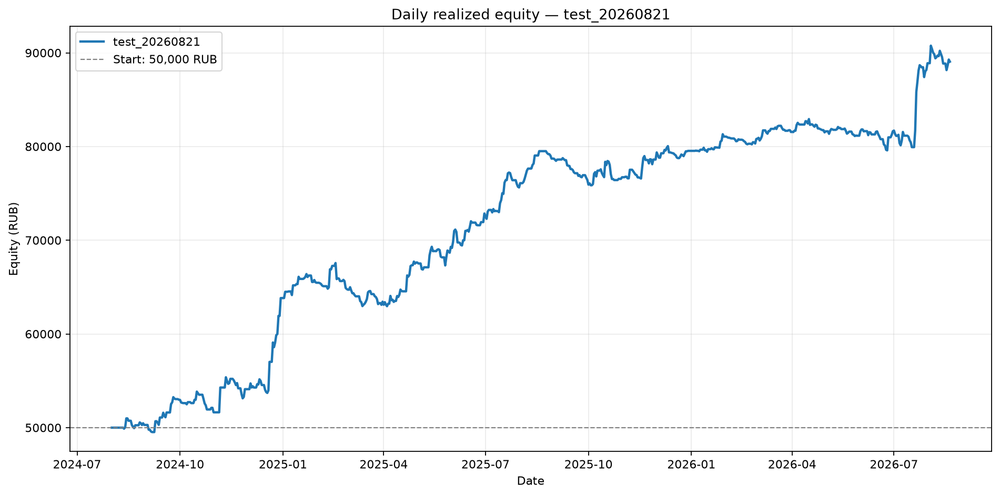
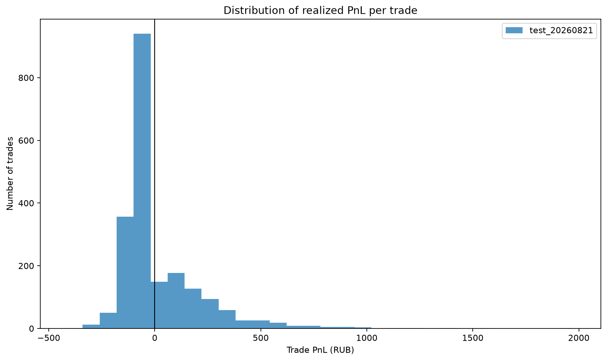
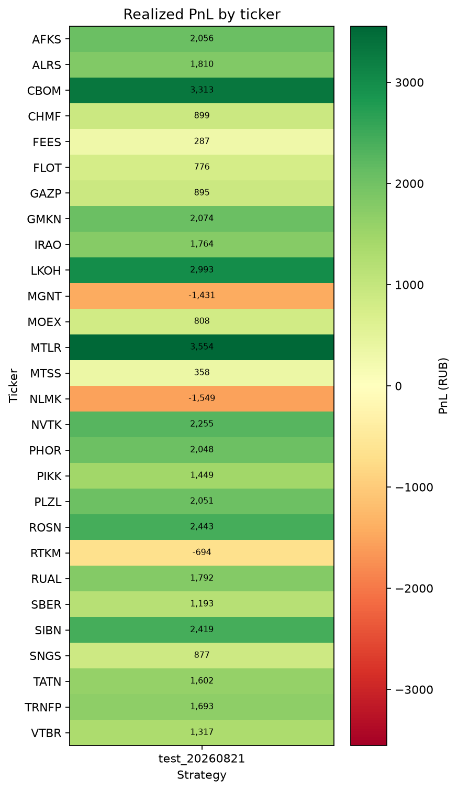
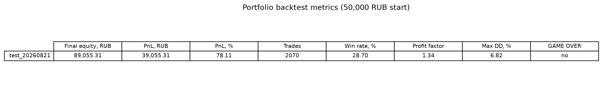

# Issue #103: портфельный бэктест test_20260821

## Резюме

Один конфиг: **test_20260821** (`trading.strategies.id=118`),
плагин `levels_reversal`. На общем капитале 50,000 RUB итоговый equity
89,055.31 RUB (+39,055.31 RUB, +78.11%).
Это исторический бэктест и не доказывает будущую доходность.

**Вердикт для продукта:** По правилам #44 ограниченный forward paper **допустим** (PnL +39,055.31 RUB, PF 1.34, n=2070, без GAME OVER; daily Max DD 6.82%). Параметры `test_20260821`, `test_20260820` и locked `test_20260731` не крутить.

## Подтверждение конфига id=118

- Имя / id: `test_20260821` / `118`.
- Paper / locked: `in_paper_test=false`,
  `locked=false`. Locked `test_20260731` (id=36)
  и swing-only `test_20260820` (id=102) не читались и не записывались
  (`locked_reference_id_untouched=36`, `swing_only_reference_id_untouched=102`).
- Plugin: `levels_reversal` (`config.strategy_name` / `resolve_strategy_name`).
- Паттерны: `signal_4h_buy, levels_reversal`.
- Уровни: `level_method=['swing', 'impulse']`,
  `swing_window=10`,
  `zone_atr_mult=0.5`,
  `level_timeframe=4h`,
  `impulse_body_ratio=0.7`,
  `impulse_atr_mult=1.5`.
- Confirm / RR: `[10]`,
  RR 1:2,
  commission 0.06%,
  slippage 0,
  n_runs `1`.
- Период: `2024-08-01` — `2026-08-20` (запрос `timestamp < 2026-08-21`,
  exclusive-конвенция `MODE_PRESETS`; #44 заканчивался exclusive `2026-08-15`).
- Вселенная: `get_tickers_by_volume(..., max_tickers=None)`, порядок = рейтинг объёма.
- Тикеры в volume-order: `FEES, IRAO, AFKS, VTBR, GAZP, SNGS, SBER, RUAL, ALRS, GMKN, MTLR, CBOM, NLMK, ROSN, RTKM, MOEX, FLOT, MTSS, NVTK, PIKK, TATN, CHMF, SIBN, PLZL, LKOH, TRNFP, MGNT, PHOR`.
- Не загружены: нет.
- SHA-256 входного JSON: `096ed9eef5b0e235438cfb30c4e94d0254a9ce5e2618b41447d31d66c1f47399`.

## Методика

- Движок: `run_portfolio_backtest` → `LevelsReversalStrategy` → `StrategyEvaluator`
  **после** #97 (вето resistance-зоны включено).
- Капитал 50,000 RUB; слот 10,000 RUB; максимум 5 позиций.
- Конкуренция: статический volume rank; нет слота → skip (`skipped_entries_no_slot`).
- Комиссия уже в `net_return_pct`.
- Equity по дням — по закрытым сделкам, без mark-to-market.
- Max DD в таблице — по equity на конец дня; event-based Max DD симулятора отдельно.
- Lab express / full-sample по 28 тикерам и сравнение с ATR в этот отчёт не входят.

## Портфельные метрики

| Стратегия | Итоговый equity, RUB | PnL, RUB | PnL, % | Сделки | Win rate | Profit factor | Max DD | GAME OVER |
|---|---:|---:|---:|---:|---:|---:|---:|:---:|
| test_20260821 | 89,055.31 | +39,055.31 | +78.11% | 2070 | 28.7% | 1.34 | 6.82% | нет |

- skipped no-slot: `489`.
- candidate trades до replay: `2559`.

### Максимальная просадка

- Daily Max DD: 6.82% с 2025-02-17
  по 2025-04-04; equity снизилась с
  67,568.81 до
  62,961.89 RUB
  (−4,606.92 RUB).
- Event-based Max DD симулятора: 9.58%.

## Анализ сделок и тикеров

- **Больше всего сделок:** IRAO (112 сделок), FLOT (111 сделок), ROSN (108 сделок), MGNT (107 сделок), PLZL (103 сделок).
- **Прибыльные:** MTLR (+3,554 RUB, 68 сделок), CBOM (+3,313 RUB, 75 сделок), LKOH (+2,993 RUB, 76 сделок), ROSN (+2,443 RUB, 108 сделок), SIBN (+2,419 RUB, 87 сделок).
- **Убыточные:** NLMK (-1,549 RUB, 75 сделок), MGNT (-1,431 RUB, 107 сделок), RTKM (-694 RUB, 60 сделок).

## Анализ по месяцам

- Прибыльные месяцы — 2024-08, 2024-09, 2024-11, 2024-12, 2025-01, 2025-04, 2025-05, 2025-06, 2025-07, 2025-08, 2025-10, 2025-11, 2025-12, 2026-01, 2026-03, 2026-06, 2026-07, 2026-08; убыточные — 2024-10, 2025-02, 2025-03, 2025-09, 2026-02, 2026-04, 2026-05.

## Точечная проверка ALRS (paper #711)

Бар `2026-08-20 11:50:24` @ 19.80 **не** найден ни среди per-ticker candidate entries, ни среди портфельных сделок. Вето #97 на этом баре сработало.

## GAME OVER

GAME OVER не наступил.

## Рекомендации

1. По правилам #44 ограниченный forward paper **допустим** (PnL +39,055.31 RUB, PF 1.34, n=2070, без GAME OVER; daily Max DD 6.82%). Параметры `test_20260821`, `test_20260820` и locked `test_20260731` не крутить.
2. Не подменять этот портфельный прогон Lab UI (`full_sample` express) и не считать
   его достаточным.
3. Не сужать вселенную до ALRS / live top-5 и не крутить RR / confirm / `level_method`.
4. Следующая итерация по правилам #44: mark-to-market equity и walk-forward, если
   продукт снова рассматривает paper.

## Контекст Issue #44 и #100 (другие конфиги, не сравнение)

Исторический пакет `analytics/issue-44-strategy-comparison/`: locked
`test_20260731` id=36, `level_method=['swing','impulse']`, exclusive
`date_to=2026-08-15`, движок **до** вето #97. Levels reversal тогда:
equity 96,343.49 RUB,
PnL +46,343.49 RUB (+92.69%),
3500 сделок, WR 28.3%,
PF 1.31, daily Max DD
5.47%.

Пакет `analytics/issue-100-test-20260820-portfolio/`: `test_20260820` id=102,
`level_method=['swing']`, exclusive `date_to=2026-08-21`, движок **после** вето #97.
Equity 87,033.31 RUB,
PnL +37,033.31 RUB (+74.07%),
1721 сделок, WR 26.4%,
PF 1.37, daily Max DD
7.16%.

Цифры даны только как фон; это другие конфиги. ATR в этом отчёте не сравнивается.

## Воспроизводимость

- Входной JSON SHA-256: `096ed9eef5b0e235438cfb30c4e94d0254a9ce5e2618b41447d31d66c1f47399`
- Код расчётов: `analysis.py`; интерактивный walkthrough: `analysis.ipynb`.

