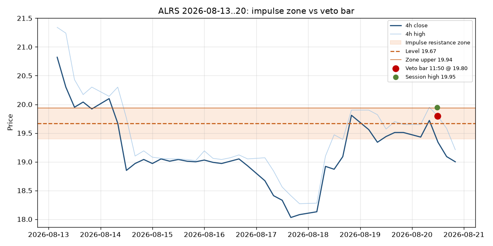

# Issue #108: ALRS 2026-08-20 case

Veto bar from Issue #97: `2026-08-20 11:50:24` @ 19.8.
Impulse resistance 19.67 zone [19.4, 19.94].

## Questions

1. Was there a 4h close > 19.94 before 11:50? **no** (0 bars).
2. Consecutive last-4h closes above 19.94: **0** (need 2 plus buffer/penetration for `LevelsTracker`).
3. Confirmed breakout (`is_broken`)? **False**.
4. Nearest resistance to 19.67 at the veto: state=`active`, price=19.67, zone=[19.399642857142858, 19.940357142857145], method=`impulse`.
5. `check_entry` at the veto bar: A=enter @ 19.8 stop=19.33 take=20.9, B swing-only=no entry, B swing+impulse=no entry.
6. Classifier on impulse+retest at the veto: `retest_window_expired`.

Session high: {'timestamp': '2026-08-20 11:40:00', 'high': 19.95, 'close': 19.89}.

The published Issue #100 A trade list has **no** ALRS fill at 11:50. Isolated `check_entry` on a short 1min window can still print a swing-only candidate; it is not a new paper signal. B (swing-only+retest) and B with impulse both stay flat.

The #97 veto stays correct if the state machine never confirmed a break of 19.94. Role reversal is not a reason to buy 19.80 inside an active impulse zone.
