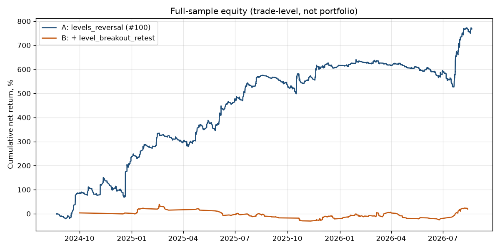
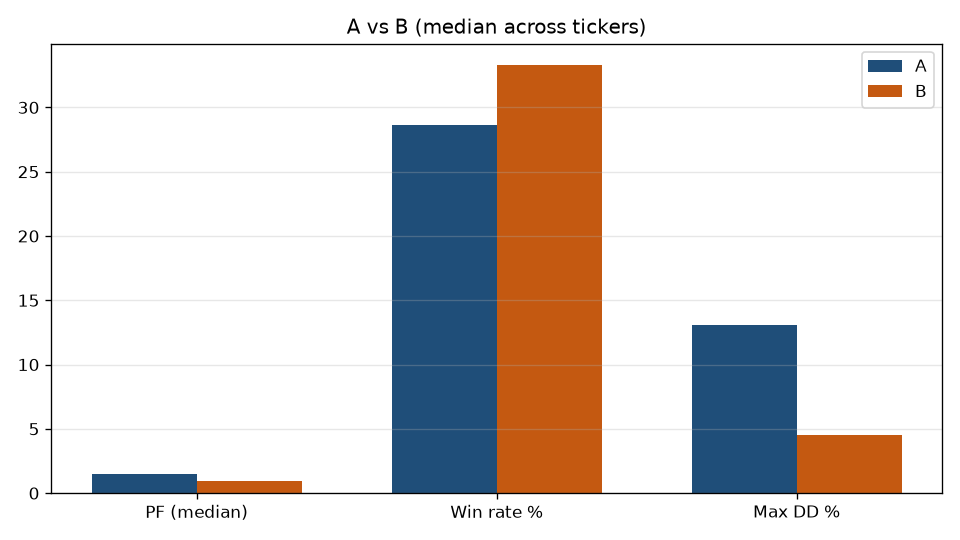

# Issue #108: full-sample A vs B

Baseline **A** is Lab `test_20260820` (id=102) after the #97 veto — the published Issue #100 universe and window. **B** is the same config plus `level_breakout_retest` (Lab defaults). Locked `test_20260731` was not rewritten. The GitHub issue JSON sketch omitted `signal_4h_buy` / confirm windows; those are required to match Issue #100.

## Aggregates

| Config | Trades | Median PF | Mean PF | PF>1 | Median WR | Median MaxDD | Pooled PF | Pooled Sharpe |
|---|---|---|---|---|---|---|---|---|
| A | 2556 | 1.52 | 1.72 | 26/28 | 28.6 | 13.1 | 1.50 | 2.51 |
| B | 257 | 0.98 | 1.19 | 14/28 | 33.3 | 4.5 | 1.07 | 0.48 |

Issue #100 bit-for-bit: **28/28** tickers (mismatches=0).

## Per ticker

| Ticker | A n | A PF | A WR | B n | B PF | B WR |
|---|---|---|---|---|---|---|
| AFKS | 45 | 1.07 | 28.9 | 7 | 0.91 | 28.6 |
| ALRS | 111 | 1.12 | 23.4 | 6 | 3.31 | 50.0 |
| CBOM | 123 | 1.39 | 27.6 | 7 | 0.82 | 42.9 |
| CHMF | 117 | 1.16 | 21.4 | 8 | 1.03 | 25.0 |
| FEES | 82 | 1.30 | 23.2 | 10 | 2.97 | 60.0 |
| FLOT | 142 | 1.45 | 23.9 | 10 | 1.24 | 50.0 |
| GAZP | 57 | 2.07 | 31.6 | 18 | 0.74 | 27.8 |
| GMKN | 56 | 2.40 | 35.7 | 7 | 2.70 | 57.1 |
| IRAO | 129 | 1.02 | 26.4 | 8 | 0.76 | 25.0 |
| LKOH | 88 | 2.30 | 29.5 | 6 | 0.47 | 33.3 |
| MGNT | 102 | 1.02 | 21.6 | 7 | 0.00 | 0.0 |
| MOEX | 105 | 1.70 | 30.5 | 13 | 1.69 | 46.2 |
| MTLR | 59 | 1.91 | 32.2 | 4 | 0.00 | 0.0 |
| MTSS | 75 | 2.04 | 33.3 | 12 | 0.95 | 33.3 |
| NLMK | 105 | 0.85 | 23.8 | 9 | 1.30 | 33.3 |
| NVTK | 82 | 1.72 | 29.3 | 6 | 1.02 | 33.3 |
| PHOR | 69 | 2.66 | 37.7 | 9 | 1.35 | 33.3 |
| PIKK | 73 | 1.90 | 27.4 | 7 | 0.00 | 0.0 |
| PLZL | 100 | 1.53 | 29.0 | 4 | 1.42 | 50.0 |
| ROSN | 104 | 1.37 | 25.0 | 13 | 0.77 | 23.1 |
| RTKM | 83 | 0.80 | 19.3 | 6 | 0.30 | 16.7 |
| RUAL | 100 | 2.14 | 34.0 | 11 | 2.26 | 54.5 |
| SBER | 93 | 1.80 | 33.3 | 5 | 0.40 | 20.0 |
| SIBN | 121 | 1.11 | 24.8 | 14 | 0.85 | 28.6 |
| SNGS | 128 | 1.23 | 25.0 | 7 | 0.59 | 28.6 |
| TATN | 102 | 1.71 | 31.4 | 10 | 2.90 | 60.0 |
| TRNFP | 31 | 5.98 | 41.9 | 18 | 1.43 | 38.9 |
| VTBR | 74 | 1.52 | 28.4 | 15 | 1.13 | 33.3 |

## Verdict

Recommendation: **refine before Lab UI / paper**.
