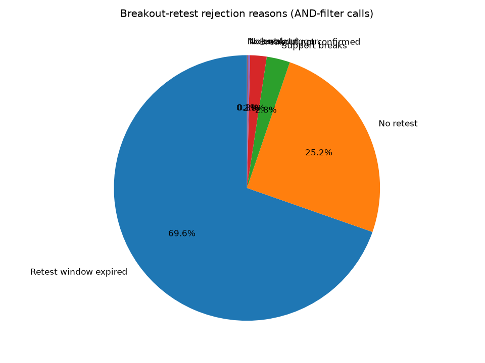

# Issue #108: rejection analysis

Counts are `check_breakout_retest` calls from config B (after `levels_reversal` + `signal_4h_buy` already passed). Accepted AND-filter hits: **259**.

| Reason | Count | Share of rejections |
|---|---|---|
| Retest window expired | 327872 | 69.6% |
| No retest | 118472 | 25.2% |
| Support breaks | 13360 | 2.8% |
| Breakout not confirmed | 9449 | 2.0% |
| No entry trigger | 1326 | 0.3% |
| No breakout | 444 | 0.1% |
