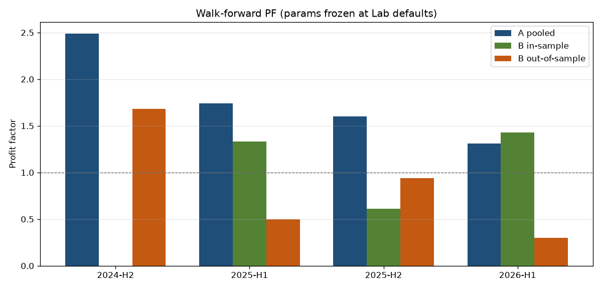

# Задача #108: walk-forward

Окна A — опубликованный Lab walk-forward задачи #100. Окна B — нарезка full-sample сделок по дате (те же 4h уровни, что в FS: `build_strategy_context` уже грузит всю HTF-историю). Дефолты заморожены (сетка 81 точка не гонялась). In-sample / out-of-sample — половины окна. Деградация >20% — флаг переобучения спецификации.

| Window | A PF | A n | B IS PF | B IS n | B OOS PF | B OOS n | Degradation | Overfit>20% |
|---|---|---|---|---|---|---|---|---|
| 2024-H2 | 2.49 | 364 | — | 0 | 1.68 | 4 | — | no |
| 2025-H1 | 1.74 | 595 | 1.33 | 26 | 0.50 | 22 | 0.624 | yes |
| 2025-H2 | 1.60 | 720 | 0.61 | 46 | 0.94 | 55 | -0.541 | no |
| 2026-H1 | 1.31 | 584 | 1.43 | 64 | 0.30 | 21 | 0.79 | yes |

Overfit flags: 2/4.
