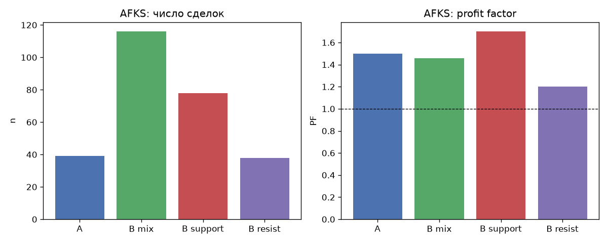
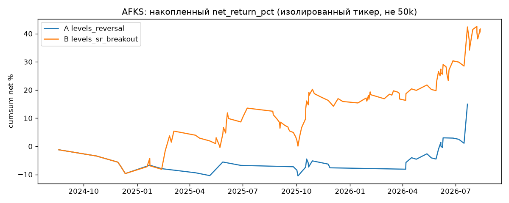
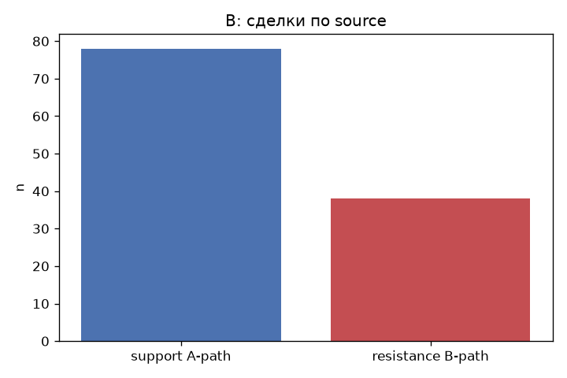

# Issue #119: smoke AFKS для `levels_sr_breakout` vs #44/#103

## Резюме

Изолированный бэктест **одного тикера AFKS** за `2024-08-01` … `timestamp < 2026-08-21`.
Это **не** портфельный replay на 50k и **не** вердикт катить в paper.

| Код | patterns | n | PF | Exp % | WR | MaxDD % |
|---|---|---:|---:|---:|---:|---:|
| A | `levels_reversal` + `signal_4h_buy` | 39 | 1.50 | 0.385 | 30.8 | 9.3 |
| B | `levels_sr_breakout` + `signal_4h_buy` | 116 | 1.46 | 0.359 | 35.3 | 13.5 |
| B support | `levels_sr_breakout_support` | 78 | 1.70 | 0.419 | 34.6 | 9.9 |
| B resistance | `levels_sr_breakout_resistance` | 38 | 1.20 | 0.236 | 36.8 | 14.1 |

B добавил **77** сделок относительно A (39 → 116):
путь B (resistance) + support-входы, которые A резал вето без трекера.

**Вердикт:** расширять вселенную.

## Конфиги

Общее: `level_timeframe=4h`, `level_method=['swing', 'impulse']`, confirm `[10]`, RR 1:2, commission 0.06%, `signal_4h_buy` включён. `level_breakout_retest` выключен.

- A SHA-256: `d859dae12afc4316ceef9b4f28f310273f9e5d71dc0afc65acdf8d9a5454167e`.
- B SHA-256: `e7d5e90c555ba3bc853216492a96ec92e4a8e985a51ce136b28d452d1452482f`.
- Снимок: `2026-08-29 23:01:21`. Референс: `test_20260821` id=118, locked=False.

Флаги стратегий на старте (после прогона те же):

- `test_20260731` (id=36): in_paper_test=True, locked=True
- `test_20260820` (id=102): in_paper_test=False, locked=False
- `test_20260821` (id=118): in_paper_test=False, locked=False

`test_20260731`, `test_20260820`, `test_20260821` не перезаписывались. Черновик Lab не создавался.

## Книги #44 и #103 (контекст, другая методика)

| Книга | Что это | AFKS |
|---|---|---|
| #44 | Портфель 50k, **без** вето #97, exclusive `date_to=2026-08-15` | 95 сделок, +2002.06 RUB (слоты, не isolated PF) |
| #103 | Портфель 50k, **после** вето, swing+impulse, то же окно | isolated AFKS в пакете нет; портфель n=2070, PF 1.34 |
| #100 Lab | Isolated Lab, **только swing**, `date_from=2024-08-21` | n=45, PF 1.07, WR 28.9% |

Цифры книг нельзя вычитать из isolated A/B как «дельта PF». A — честная база после вето на одном тикере (без трекера в вето). B — тот же период и фильтры, но OR двух путей **и** вето с `LevelsTracker` (пробитое сопротивление не opposing zone). Поэтому B-support (78) ≠ A (39): это не удвоение и не баг.

## Source кандидата

Неразмеченных сделок B: **0** (должно быть 0).

### Выборочное описание пути B

- `2025-01-22 18:10:00` вход 14.931, выход 14.543785714285713 (stop, -2.653%), source=`levels_sr_breakout_resistance`. Path B: confirmed resistance break + retest. No native support zone required. Stop/take are ATR×RR, not a purchase inside an *active* resistance without a break.
- `2025-02-14 13:37:00` вход 16.126, выход 17.18557142857143 (take, +6.511%), source=`levels_sr_breakout_resistance`. Path B: confirmed resistance break + retest. No native support zone required. Stop/take are ATR×RR, not a purchase inside an *active* resistance without a break.

Бар ALRS 2026-08-20 11:50 @ 19.80 к AFKS не относится. На AFKS смотрим метрики и `source`.

## Plugin / Lab HTF

Третий прогон — `run_portfolio_backtest` с тем же конфигом B (тот же путь, что Lab `_run_job` после #116): status=success, n_match=True (B=116, plugin=116), source на plugin-сделках=False.

Plugin-сделки сейчас **не** копируют `source` из `EntrySignal.metadata` — для разметки пути используйте `run_strategy_backtest`.

## Вердикт для продукта

- Путь B добавил 38 сделок с source=levels_sr_breakout_resistance (PF пути B 1.20).
- Support-путь B дал 78 сделок против 39 у A (+39). Композит передаёт LevelsTracker в вето: пробитое сопротивление больше не режет support-вход.
- Смесь B дала на 77 сделок больше, чем база A (39 → 116).
- PF смеси B (1.46) ниже базы A (1.50). Расширять вселенную только если путь B отдельно устойчив.
- Путь A внутри B: 78 сделок (`levels_sr_breakout_support`).
- Это smoke одного тикера, не портфель 50k и не вердикт катить в paper.

Locked и эталонные стратегии не менять. Следующий шаг — только если вердикт просит расширить вселенную или сетку ретеста.

## Воспроизводимость

- Конфиги и SHA: `inputs.json`.
- Прогоны: `results.json` (`extract_inputs.py`).
- Код: `analysis.py`.
