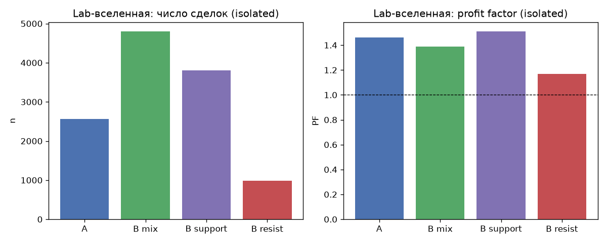
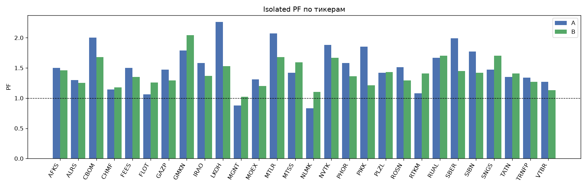
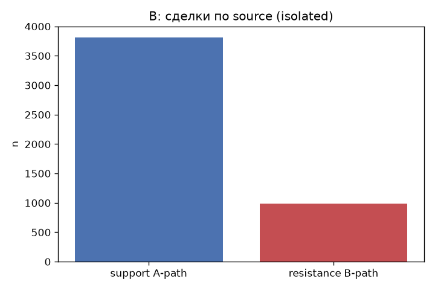
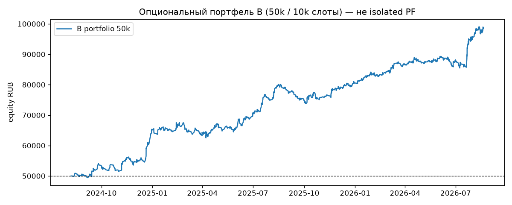

# Issue #124: `levels_sr_breakout` на полной Lab-вселенной vs #103/#119

## Резюме

Изолированный бэктест **28 тикеров** `get_big_tickers(min_candles=250000)`
за `2024-08-01` … `timestamp < 2026-08-21`. Это **не** портфель 50k и **не** вердикт катить в paper.

| Код | patterns | n | PF | Exp % | WR | MaxDD % |
|---|---|---:|---:|---:|---:|---:|
| A | `levels_reversal` + `signal_4h_buy` | 2559 | 1.46 | 0.254 | 29.8 | 34.8 |
| B | `levels_sr_breakout` + `signal_4h_buy` | 4799 | 1.39 | 0.216 | 32.3 | 27.9 |
| B support | `levels_sr_breakout_support` | 3811 | 1.51 | 0.230 | 30.9 | 27.5 |
| B resistance | `levels_sr_breakout_resistance` | 988 | 1.17 | 0.164 | 37.4 | 35.3 |

Агрегаты по тикерам (isolated PF, не слоты):

| Код | median PF | mean PF | PF>1 | сделок |
|---|---:|---:|---:|---:|
| A | 1.48 | 1.51 | 26/28 | 2559 |
| B | 1.39 | 1.41 | 28/28 | 4799 |

B добавил **2240** сделок относительно A (2559 → 4799).
Неразмеченных сделок B: **0** (должно быть 0).

**Вердикт:** портфельный replay. Paper: нет.

## Конфиги

Те же SHA, что в #119.

- A SHA-256: `d859dae12afc4316ceef9b4f28f310273f9e5d71dc0afc65acdf8d9a5454167e`.
- B SHA-256: `e7d5e90c555ba3bc853216492a96ec92e4a8e985a51ce136b28d452d1452482f`.
- Вселенная: `28` имён, `get_big_tickers`, не `run_params.tickers` и не live top-5.
- Снимок: `2026-08-30 00:10:33`. Референс: `test_20260821` id=118.

Флаги стратегий (после прогона те же):

- `test_20260731` (id=36): in_paper_test=True, locked=True
- `test_20260820` (id=102): in_paper_test=False, locked=False
- `test_20260821` (id=118): in_paper_test=False, locked=False

`test_20260731`, `test_20260820`, `test_20260821` не перезаписывались.

## Регрессия AFKS (#119)

| Код | это | #119 |
|---|---|---|
| A | n=39 PF 1.50 | n=39 PF 1.50 |
| B | n=116 PF 1.46 | n=116 PF 1.46 |

Совпадение: **да**.

Бар ALRS `2026-08-20 11:50:24` @ 19.80: A **нет (ok)**, B **нет (ok)**.

## Таблица по тикерам

| Тикер | n A | PF A | n B | PF B | B support | B resist | extra support |
|---|---:|---:|---:|---:|---:|---:|---:|
| AFKS | 39 | 1.50 | 116 | 1.46 | 78 | 38 | +39 |
| ALRS | 124 | 1.30 | 166 | 1.25 | 131 | 35 | +7 |
| CBOM | 87 | 2.00 | 224 | 1.68 | 179 | 45 | +92 |
| CHMF | 103 | 1.14 | 133 | 1.18 | 105 | 28 | +2 |
| FEES | 80 | 1.50 | 185 | 1.35 | 148 | 37 | +68 |
| FLOT | 129 | 1.06 | 265 | 1.26 | 230 | 35 | +101 |
| GAZP | 65 | 1.47 | 140 | 1.29 | 99 | 41 | +34 |
| GMKN | 52 | 1.79 | 151 | 2.04 | 117 | 34 | +65 |
| IRAO | 133 | 1.58 | 185 | 1.37 | 155 | 30 | +22 |
| LKOH | 91 | 2.26 | 144 | 1.53 | 114 | 30 | +23 |
| MGNT | 128 | 0.88 | 150 | 1.02 | 125 | 25 | -3 |
| MOEX | 127 | 1.31 | 195 | 1.20 | 160 | 35 | +33 |
| MTLR | 81 | 2.07 | 117 | 1.68 | 95 | 22 | +14 |
| MTSS | 73 | 1.42 | 153 | 1.59 | 117 | 36 | +44 |
| NLMK | 100 | 0.83 | 157 | 1.10 | 122 | 35 | +22 |
| NVTK | 74 | 1.88 | 168 | 1.67 | 139 | 29 | +65 |
| PHOR | 97 | 1.58 | 236 | 1.36 | 200 | 36 | +103 |
| PIKK | 83 | 1.85 | 167 | 1.21 | 126 | 41 | +43 |
| PLZL | 117 | 1.42 | 198 | 1.43 | 150 | 48 | +33 |
| ROSN | 128 | 1.51 | 176 | 1.29 | 151 | 25 | +23 |
| RTKM | 76 | 1.08 | 146 | 1.41 | 118 | 28 | +42 |
| RUAL | 91 | 1.67 | 175 | 1.70 | 136 | 39 | +45 |
| SBER | 82 | 1.99 | 184 | 1.45 | 149 | 35 | +67 |
| SIBN | 104 | 1.77 | 167 | 1.42 | 130 | 37 | +26 |
| SNGS | 84 | 1.47 | 159 | 1.70 | 128 | 31 | +44 |
| TATN | 71 | 1.35 | 196 | 1.41 | 149 | 47 | +78 |
| TRNFP | 67 | 1.34 | 190 | 1.27 | 138 | 52 | +71 |
| VTBR | 73 | 1.27 | 156 | 1.13 | 122 | 34 | +49 |

## Выборочные сделки пути B

- `AFKS` `2025-01-22 18:10:00` вход 14.931, выход 14.543785714285713 (stop, -2.653%), source=`levels_sr_breakout_resistance`. Path B: confirmed resistance break + retest. No native support zone required. Stop/take are ATR×RR, not a purchase inside an *active* resistance without a break.
- `ALRS` `2024-09-18 13:40:00` вход 51.83, выход 54.14571428571428 (take, +4.408%), source=`levels_sr_breakout_resistance`. Path B: confirmed resistance break + retest. No native support zone required. Stop/take are ATR×RR, not a purchase inside an *active* resistance without a break.

## Книги #44 / #103 (другая методика)

| Книга | Что это | Цифра |
|---|---|---|
| #44 | Портфель 50k, без вето | n=3500, PF 1.31 |
| #103 | Портфель 50k, после вето, swing+impulse | n=2070, PF 1.34, equity 89055.31 |

Цифры книг нельзя вычитать из isolated A/B как «дельта PF». Isolated A — честная база после вето без слотов. Isolated B — OR двух путей и вето с `LevelsTracker`.

## Опциональный портфельный replay B

Отдельный блок, **не** isolated PF. Кандидаты B n=4799, портфель n=2837, PF 1.32, equity 98432.94 RUB (96.87%), пропущено слотов 1962, GAME OVER=False. В портфеле support=2279 / resistance=558. ALRS 19.80: нет. Это не вердикт катить в paper.

## Вердикт для продукта

- AFKS совпал с #119: A 39/1.50, B 116/1.46.
- Бар ALRS 2026-08-20 11:50 @ 19.80 отсутствует в A и в B.
- Путь B добавил 988 сделок `levels_sr_breakout_resistance` (PF пути B 1.17).
- Support-путь B дал 3811 сделок против 2559 у A (+1252). Композит передаёт LevelsTracker в вето.
- Смесь isolated: A n=2559 PF 1.46 → B n=4799 PF 1.39 (добавлено 2240).
- По тикерам B: median PF 1.39, mean PF 1.41, доля PF>1 28/28 (100.0%).
- Isolated B устойчив (median PF>1, путь B не уводит смесь ниже PF 1) — имеет смысл один портфельный replay 50k/10k, не paper.
- Это isolated Lab-вселенная, не вердикт катить в paper.

Locked и эталонные стратегии не менять.

## Воспроизводимость

- Конфиги и SHA: `inputs.json`.
- Прогоны: `results.json` (`extract_inputs.py`).
- Код: `analysis.py`.
