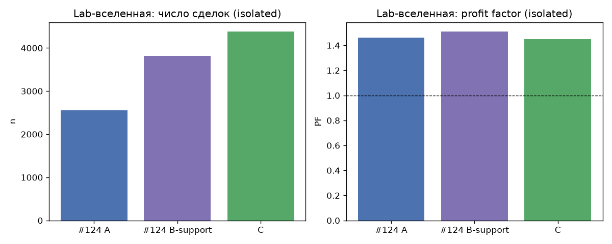
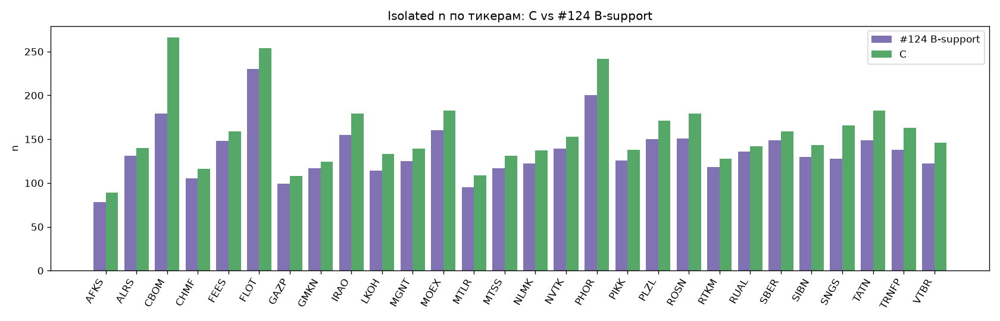
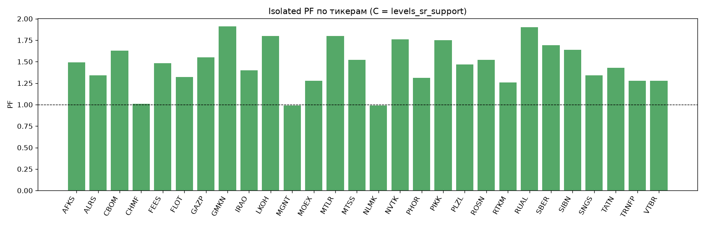

# Issue #129: `levels_sr_support` на полной Lab-вселенной vs #124 B-support

## Резюме

Изолированный бэктест **28 тикеров** `get_big_tickers(min_candles=250000)`
за `2024-08-01` … `timestamp < 2026-08-21`. Это **не** портфель 50k и **не** вердикт катить в paper.

Колонка **B-support** в #124 — exclusive-подпись композита (путь B забирает dual-бар
и занимает единственный слот). Isolated C — runnable `levels_sr_support` без ретеста:
книга B-support должна входить в C, extra-сделки объясняются occupancy пути B.

| Код | patterns | n | PF | Exp % | WR | MaxDD % |
|---|---|---:|---:|---:|---:|---:|
| #124 A | `levels_reversal` + `signal_4h_buy` | 2559 | 1.46 | — | — | — |
| #124 B-support exclusive | `levels_sr_breakout_support` | 3811 | 1.51 | 0.230 | 30.9 | — |
| C isolated | `levels_sr_support` + `signal_4h_buy` | 4380 | 1.45 | 0.197 | 30.5 | 28.8 |

Агрегаты по тикерам (isolated PF, не слоты):

| Код | median PF | mean PF | PF>1 | сделок |
|---|---:|---:|---:|---:|
| C | 1.48 | 1.47 | 26/28 | 4380 |

Сделки resistance/ретеста: **0** (должно быть 0).
Неразмеченных: **0**. Other source: **0**.
Exclusive n/PF 3811 / 1.51: **нет**.

**Вердикт:** совпало. Paper: нет. Портфель #130: да.

## Конфиг C

- C SHA-256: `3b7864c4de2cb2c7d271be8c21c7d99c29bfd8a7dd05980b3c5497b6b2aedb1b`.
- patterns: **только** `levels_sr_support` + `signal_4h_buy`.
- `levels_reversal`, `levels_sr_breakout`, `level_breakout_retest` выключены.
- Вселенная: `28` имён, `get_big_tickers`, не `run_params.tickers` и не live top-5.
- Снимок: `2026-08-30 17:42:59`. Референс: `test_20260821` id=118.

Флаги стратегий (после прогона те же):

- `test_20260731` (id=36): in_paper_test=True, locked=True
- `test_20260820` (id=102): in_paper_test=False, locked=False
- `test_20260821` (id=118): in_paper_test=False, locked=False

`test_20260731`, `test_20260820`, `test_20260821` не перезаписывались.

## Регрессия vs #124 B-support

По равенству n тикеров с exclusive-колонкой: **нет**
(0/28). Δ = occupancy extra.

B-support ⊆ C: **нет**. C n=4380, #124 support n=3811, missing=42, extra=611.

Extra 611: occupancy 610, near-miss 0, leftover 1, extra PF 0.95.

Missing 42: occupancy extra 42, near-miss 0, unexplained 0.

## Регрессия AFKS (#119 / #124 B-support)

| Код | это | exclusive / mix |
|---|---|---|
| C isolated | n=89 PF 1.49 | exclusive 78 / 1.70 |
| не mix | subset=True | mix 116 / 1.46 |

Subset B-support ⊆ C: **да**.
Ошибочно совпало со смесью 116/1.46: **нет**.

Бар ALRS `2026-08-20 11:50:24` @ 19.80: **нет (ok)**.

## Таблица по тикерам

| Тикер | n #124 support | n C | Δ | PF C | match |
|---|---:|---:|---:|---:|:---:|
| AFKS | 78 | 89 | +11 | 1.49 | occupancy |
| ALRS | 131 | 140 | +9 | 1.34 | occupancy |
| CBOM | 179 | 266 | +87 | 1.63 | occupancy |
| CHMF | 105 | 116 | +11 | 1.01 | occupancy |
| FEES | 148 | 159 | +11 | 1.48 | occupancy |
| FLOT | 230 | 254 | +24 | 1.32 | occupancy |
| GAZP | 99 | 108 | +9 | 1.55 | occupancy |
| GMKN | 117 | 124 | +7 | 1.91 | occupancy |
| IRAO | 155 | 179 | +24 | 1.40 | occupancy |
| LKOH | 114 | 133 | +19 | 1.80 | occupancy |
| MGNT | 125 | 139 | +14 | 0.99 | occupancy |
| MOEX | 160 | 183 | +23 | 1.28 | occupancy |
| MTLR | 95 | 109 | +14 | 1.80 | occupancy |
| MTSS | 117 | 131 | +14 | 1.52 | occupancy |
| NLMK | 122 | 137 | +15 | 0.99 | occupancy |
| NVTK | 139 | 153 | +14 | 1.76 | occupancy |
| PHOR | 200 | 242 | +42 | 1.31 | occupancy |
| PIKK | 126 | 138 | +12 | 1.75 | occupancy |
| PLZL | 150 | 171 | +21 | 1.47 | occupancy |
| ROSN | 151 | 179 | +28 | 1.52 | occupancy |
| RTKM | 118 | 128 | +10 | 1.26 | occupancy |
| RUAL | 136 | 142 | +6 | 1.90 | occupancy |
| SBER | 149 | 159 | +10 | 1.69 | occupancy |
| SIBN | 130 | 143 | +13 | 1.64 | occupancy |
| SNGS | 128 | 166 | +38 | 1.34 | occupancy |
| TATN | 149 | 183 | +34 | 1.43 | occupancy |
| TRNFP | 138 | 163 | +25 | 1.28 | occupancy |
| VTBR | 122 | 146 | +24 | 1.28 | occupancy |

## Вердикт для продукта

- Isolated C n=4380 PF 1.45 ≠ exclusive #124 B-support 3811 / 1.51. Колонка B-support — exclusive-подпись композита (путь B занимает слот). Isolated C — runnable support-only; extra появляются, когда слот свободен.
- Ключи: C n=4380, #124 support n=3811, missing=42, extra=611.
- Все 42 missing B-support объясняются слотом C (occupancy extra 42, near-miss ≤120s 0).
- 610/611 extra-сделок C объясняются occupancy композита (путь B / слот) и near-miss; остаток 1 (допуск ≤1). Extra PF 0.95.
- AFKS: книга B-support входит в C (n C=89 PF 1.49; exclusive 78 / 1.70, не mix 116 / 1.46).
- Бар ALRS 2026-08-20 11:50 @ 19.80 отсутствует.
- Нет сделок пути resistance / ретеста (`source=levels_sr_support`).
- По тикерам C: median PF 1.48, mean PF 1.47, доля PF>1 26/28.
- Это isolated Lab-вселенная, не вердикт катить в paper.
- Движок совпал с путём поддержки #124; isolated-книга C (occupancy extra) идёт в портфель #130, а не exclusive-колонка 3811 / 1.51.

Locked и эталонные стратегии не менять. Jupyter / портфель 50k — задача #130 по книге C.

## Воспроизводимость

- Конфиг и SHA: `inputs.json`.
- Прогон: `results.json` (`extract_inputs.py`).
- Код: `analysis.py`.
- Целевая книга: `analytics/issue-124-sr-breakout-universe/`.
