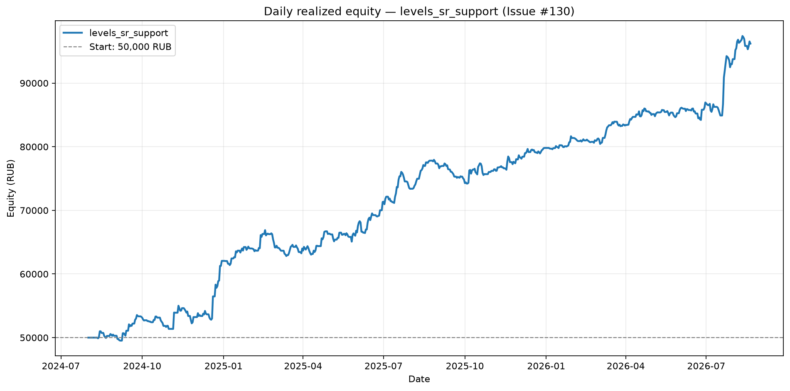
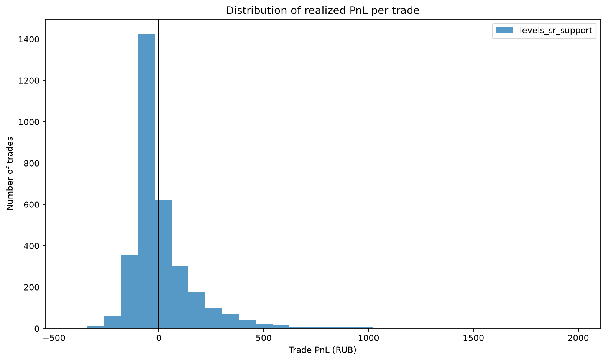
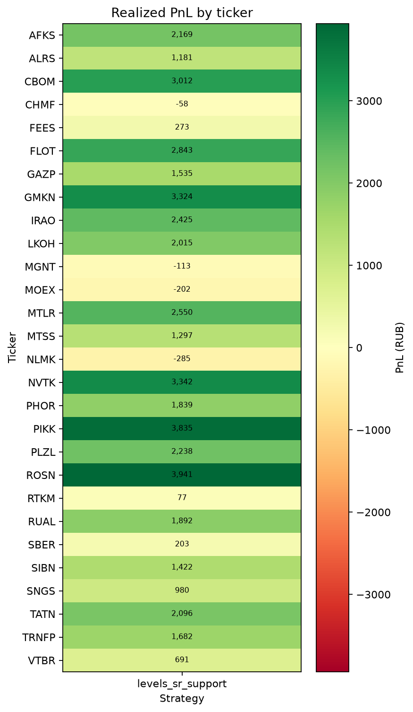
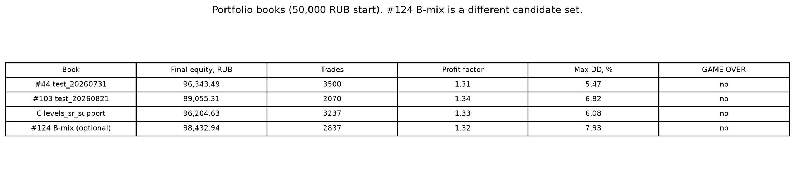

# Issue #130: портфель 50k levels_sr_support

## Резюме

Конфиг **C** (`levels_sr_support` + `signal_4h_buy`, SHA `3b7864c4de2cb2c7d271be8c21c7d99c29bfd8a7dd05980b3c5497b6b2aedb1b`),
кандидаты из isolated-книги #129 (n=4380).
На общем капитале 50,000 RUB итоговый equity 96,204.63 RUB
(+46,204.63 RUB, +92.41%).
Это исторический бэктест и не доказывает будущую доходность.

**Вердикт для продукта:** не paper. Гейты #44 (PnL>0, PF>1, n≥30, нет GAME OVER) пройдены, но вердикт продукта — **не paper** без явного решения PO.

## Подтверждение конфига C

- Имя: `levels_sr_support`. Lab-черновик не lock/paper-flag.
- Paper / locked: `in_paper_test=false`, `locked=false`.
- Locked `test_20260731` (id=36), swing-only `test_20260820` (id=102) и
  `test_20260821` (id=118) не читались и не записывались.
- Движок кандидатов: `run_strategy_backtest` (пакет #129). На сделках
  `source=levels_sr_support`. Plugin-имя в Lab по-прежнему `levels_reversal`.
- Паттерны: `levels_sr_support, signal_4h_buy`.
- Уровни: `level_method=['swing', 'impulse']`,
  `swing_window=10`,
  `zone_atr_mult=0.5`,
  `level_timeframe=4h`,
  `impulse_body_ratio=0.7`,
  `impulse_atr_mult=1.5`.
- Confirm / RR: `[10]`,
  RR 1.0:2.0,
  commission 0.06%,
  slippage 0.0,
  n_runs `1`.
- Период: `2024-08-01` — `2026-08-20` (запрос `timestamp < 2026-08-21`).
- Вселенная: пересечение `get_big_tickers` с volume-order #103/#44 (28 имён).
- Тикеры в volume-order: `FEES, IRAO, AFKS, VTBR, GAZP, SNGS, SBER, RUAL, ALRS, GMKN, MTLR, CBOM, NLMK, ROSN, RTKM, MOEX, FLOT, MTSS, NVTK, PIKK, TATN, CHMF, SIBN, PLZL, LKOH, TRNFP, MGNT, PHOR`.
- Не загружены: нет.
- SHA конфига C: `3b7864c4de2cb2c7d271be8c21c7d99c29bfd8a7dd05980b3c5497b6b2aedb1b`.
- SHA-256 входного JSON: `0c2ccb5f8cbbd3f8438a050daa6de17f77628d05229ae6ea6aa30df310da8921`.

## Методика

- Кандидаты — isolated C из `analytics/issue-129-sr-support-universe/`
  (**не** exclusive-колонка #124 3811 / 1.51 и **не** `source=`-фильтр композита).
- Капитал 50,000 RUB; слот 10,000 RUB; максимум 5 позиций.
- Конкуренция: статический volume rank; нет слота → skip (`skipped_entries_no_slot`).
- Комиссия уже в `net_return_pct`.
- Equity по дням — по закрытым сделкам, без mark-to-market.
- Max DD в таблице — по equity на конец дня; event-based Max DD симулятора отдельно.
- Isolated PF #129 (1.45) с портфельным PF не смешивать.

## Сравнение книг

| Книга | Что это | Equity, RUB | n | PF | Max DD | GAME OVER |
|---|---|---:|---:|---:|---:|:---:|
| #44 `test_20260731` | портфель до вето, `date_to=2026-08-15` | 96,343.49 | 3500 | 1.31 | 5.47% | нет |
| #103 `test_20260821` | портфель после вето, без трекера | 89,055.31 | 2070 | 1.34 | 6.82% | нет |
| C `levels_sr_support` | эта задача, вето **с** трекером, без ретеста | 96,204.63 | 3237 | 1.33 | 6.08% | нет |
| #124 B-mix | композит support+resistance, другой набор кандидатов | 98,432.94 | 2837 | 1.32 | 7.93%* | нет |

\* у B-mix в пакете #124 опубликован event-based Max DD симулятора, не daily.

Isolated C (не портфель): n=4380, PF 1.45. Exclusive B-support 3811 / 1.51 в портфель не брался.

## Портфельные метрики C

| Стратегия | Итоговый equity, RUB | PnL, RUB | PnL, % | Сделки | Win rate | Profit factor | Max DD | GAME OVER |
|---|---:|---:|---:|---:|---:|---:|---:|:---:|
| levels_sr_support | 96,204.63 | +46,204.63 | +92.41% | 3237 | 28.7% | 1.33 | 6.08% | нет |

- skipped no-slot: `1143`.
- candidate trades до replay: `4380`.
- source: support n=3237, resistance n=0.

### Максимальная просадка

- Daily Max DD: 6.08% с 2025-02-17
  по 2025-03-13; equity снизилась с
  66,889.89 до
  62,820.64 RUB
  (−4,069.25 RUB).
- Event-based Max DD симулятора: 6.98%.

## Анализ сделок и тикеров

- **Больше всего сделок:** CBOM (209 сделок), FLOT (200 сделок), PHOR (184 сделок), MOEX (141 сделок), IRAO (137 сделок).
- **Прибыльные:** ROSN (+3,941 RUB, 129 сделок), PIKK (+3,835 RUB, 106 сделок), NVTK (+3,342 RUB, 108 сделок), GMKN (+3,324 RUB, 91 сделок), CBOM (+3,012 RUB, 209 сделок).
- **Убыточные:** NLMK (-285 RUB, 99 сделок), MOEX (-202 RUB, 141 сделок), MGNT (-113 RUB, 98 сделок), CHMF (-58 RUB, 75 сделок).

## Анализ по месяцам

- Прибыльные месяцы — 2024-08, 2024-09, 2024-11, 2024-12, 2025-01, 2025-02, 2025-04, 2025-05, 2025-06, 2025-07, 2025-08, 2025-10, 2025-11, 2025-12, 2026-01, 2026-03, 2026-04, 2026-05, 2026-06, 2026-07, 2026-08; убыточные — 2024-10, 2025-03, 2025-09, 2026-02.

## Точечная проверка ALRS (paper #711)

Бар `2026-08-20 11:50:24` @ 19.80 **не** найден ни среди candidate entries, ни среди портфельных сделок. Вето #97 на этом баре сработало.

## GAME OVER

GAME OVER не наступил.

## Рекомендации

1. не paper: Гейты #44 (PnL>0, PF>1, n≥30, нет GAME OVER) пройдены, но вердикт продукта — **не paper** без явного решения PO.
2. Не подменять этот портфель isolated PF #129 и не смешивать с #124 B-mix.
3. Не lock/overwrite `test_20260731`, `test_20260820`, `test_20260821`.
4. Черновик Lab, если понадобится: `test_YYYYMMDD_sr_support` — не перезаписывать чужие строки.

## Воспроизводимость

- SHA конфига C: `3b7864c4de2cb2c7d271be8c21c7d99c29bfd8a7dd05980b3c5497b6b2aedb1b`
- Входной JSON SHA-256: `0c2ccb5f8cbbd3f8438a050daa6de17f77628d05229ae6ea6aa30df310da8921`
- Код расчётов: `analysis.py`; интерактивный walkthrough: `analysis.ipynb`.

