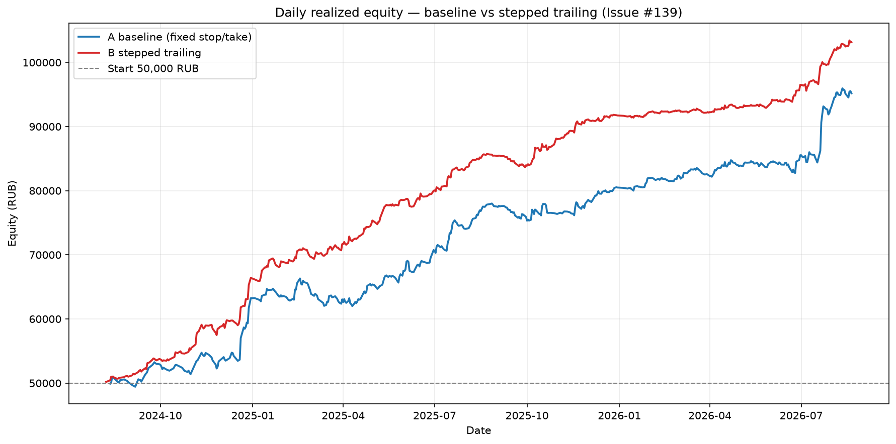
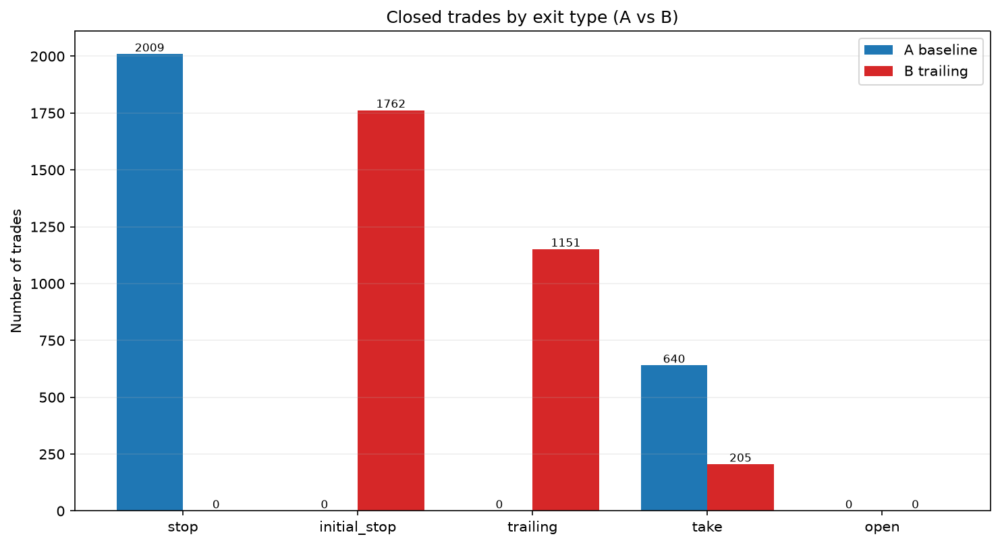

# Issue #139 — stepped trailing stop on `test_20260830_new_level` (50k simulator)

A/B in the portfolio simulator: 50,000 RUB, slot 10,000, max 5 positions,
volume priority, GAME OVER at cash <= 0. **The only difference between A and B is
the exit rule.** Entry, initial 1R risk, commission and universe are identical.

This is an historical backtest; it does not prove future performance.

## Конфигурация (id=126, locked, точно из `config`)

- Паттерны: `signal_4h_buy` + `levels_sr_support`.
- Уровни: `level_method=['swing', 'impulse']`, `swing_window=10`,
  `zone_atr_mult=0.5`, `level_timeframe=4h`,
  `impulse_atr_mult=1.5`, `impulse_body_ratio=0.7`.
- RR: 1:3; commission 0.06%; slippage 0.
- Период: `2024-08-01` … `timestamp < 2026-08-21` (последний день `2026-08-20`) — полный, не экспресс.
- Вселенная: 28 тикеров из `run_params.tickers`.
- Ступени трейлинга (в R от входа, конфигурируемы в `trailing.py`): **+2.0R->+1.5R, +2.5R->+2.0R**. Тейк не меняется; трейлинг только поджимает стоп.
- SHA-256 конфига id=126: `dfc855195adef75ddaee2971535bef5c6aa53ed80ff91dac72fd0df15f1971ff`.
- SHA-256 `results.json`: `acd6bc5fd87568111d660f03f9d3a650675d890c66e304cf7741f13b22d1fb20`.
- Защитные строки (126 / 36 / 102 / 118) не менялись.

## Metrics A/B

| Book | Equity, RUB | PnL, RUB | PnL, % | Trades | Win rate | PF | Max DD (daily) | GAME OVER | Avg PnL/trade |
|---|---:|---:|---:|---:|---:|---:|---:|:---:|---:|
| **A baseline** | 95,180.01 | +45,180.01 | +90.36% | 2649 | 24.2% | 1.41 | 6.49% | no | 17.06 |
| **B trailing** | 103,176.00 | +53,176.00 | +106.35% | 3118 | 42.3% | 1.54 | 2.74% | no | 17.05 |

- Кандидатов (входов): `3305`; дошли до +2R: `1578`
  (только у них трейлинг может изменить исход; у остальных B = A).
- Skipped no-slot: A `656`, B `187`.
- Event-based Max DD: A `7.95%`, B `3.02%`.

## Закрытия по типу выхода / Closes by exit type

| Тип / Type | A | B |
|---|---:|---:|
| initial stop | 2009 | 1762 |
| trailing stop | 0 | 1151 |
| take | 640 | 205 |

Доля закрытий по трейлинг-стопу в B / trailing share in B: **36.9%**
(тейк/take 6.6%, начальный стоп/initial stop 56.5%).

## Вердикт / Verdict

- Итоговый капитал / final equity: A 95,180.01 RUB -> B 103,176.00 RUB
  (delta **+7,995.99 RUB**, +8.40%).
- Трейлинг улучшает капитал / trailing improves capital: **да / YES**.
- GAME OVER: A no, B no.
- Рекомендация / recommendation: **внедрять (consider adopting)**.

