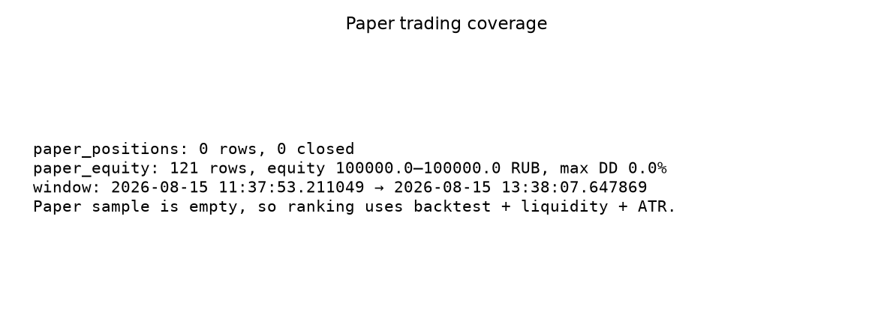
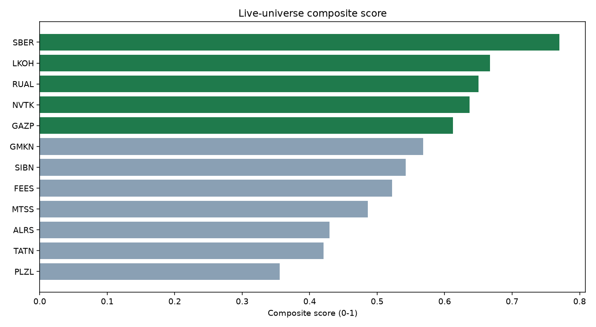
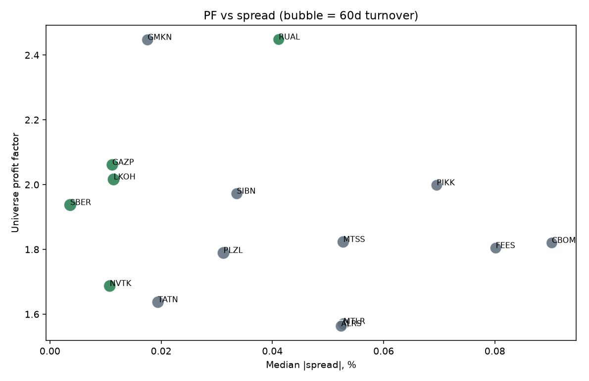
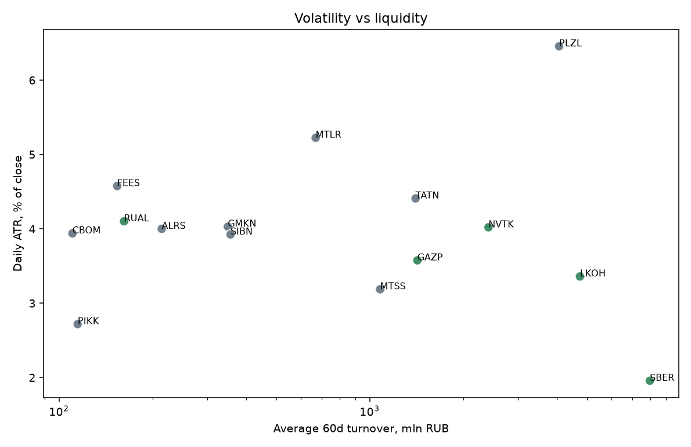

# Issue #66: топ-5 тикеров для live trading

## Резюме

Для sandbox live trading рекомендуется вселенная **SBER, LKOH, RUAL, NVTK, GAZP**.
Paper trading не дал закрытых сделок, поэтому выбор опирается на бэктест locked-стратегии
`test_20260731`, исторический PF вселенной и рыночную ликвидность/волатильность.
Это не доказательство будущей доходности.

## Данные и ограничения

- Снимок: `2026-08-17 22:35:21`.
- Кандидаты: 15 тикеров из `trading.trading_universe`. Live-фильтр imbalance требует свежий стакан;
  котировки `online_orderbook_aggregates` есть только по этой вселенной.
- Paper trading: `0` строк в `paper_positions`
  (closed=0, open=0).
- Paper equity: `121` строк, equity
  `100000.0–100000.0` RUB,
  max DD `0.0%`,
  окно `2026-08-15 11:37:53.211049 → 2026-08-15 13:38:07.647869`.
- Locked-стратегия: `test_20260731` (id=36),
  patterns `['levels_reversal', 'signal_4h_buy']`, confirm `[10]`,
  RR `{'risk': 1, 'reward': 2}`, commission `0.06%`.
- Full-sample locked backtest: `2026-07-01` — `2026-07-31`,
  depth `express`. Выборка короткая (один месяц), поэтому PF/WR используются
  как фильтр и как один из факторов, а не как единственный критерий.
- Walk-forward для locked-стратегии в `backtest_results` отсутствует.



## Методика

1. Кандидатный набор — текущий top-15 `trading_universe` (источник: levels_reversal matrix PF).
2. Жёсткие исключения: нет стакана; 1 лот дороже 50,000 RUB;
   locked-strategy PF < 1.0 при n ≥ 5.
3. Композитный score — взвешенные percentile ranks:
   universe PF 25%, locked PF 18%, expectancy 8%, n сделок 6%,
   обратный maxDD 10%, обратный спред 15%, log оборота 10%, log глубины стакана 5%,
   ATR-fit 3%. Пропуски не штрафуют: вес перераспределяется на доступные факторы.
4. Диверсификация: не больше 2 тикеров из одного сектора.
5. Paper PnL/win-rate/drawdown по тикерам недоступны (пустая `paper_positions`);
   портфельный drawdown paper equity равен 0.



## Финальный список

| # | Тикер | Сектор | Score | Universe PF | Strategy PF | n | WR | MaxDD | Spread | ATR |
|---|---|---|---:|---:|---:|---:|---:|---:|---:|---:|
| 1 | SBER | banks | 0.770 | 1.937 | — | — | — | — | 0.004% | 1.96% |
| 2 | LKOH | oil | 0.667 | 2.016 | 1.59 | 10 | 40.0% | 1.5% | 0.011% | 3.36% |
| 3 | RUAL | metals | 0.650 | 2.448 | — | — | — | — | 0.041% | 4.10% |
| 4 | NVTK | gas | 0.637 | 1.687 | 2.56 | 27 | 37.0% | 3.1% | 0.011% | 4.02% |
| 5 | GAZP | oil | 0.612 | 2.061 | 1.51 | 16 | 31.2% | 4.2% | 0.011% | 3.58% |





### Обоснование

- **SBER** (banks): universe PF 1.937 (rank 7); нет полного прогона locked-стратегии за июль 2026; median spread 0.004%; 60d turnover 7976.6 mln RUB; ATR 1.96%; issue #44 portfolio PnL -257 RUB.
- **LKOH** (oil): universe PF 2.016 (rank 4); locked-strategy PF 1.59, n=10, WR 40.0%, maxDD 1.5%; median spread 0.011%; 60d turnover 4750.2 mln RUB; ATR 3.36%.
- **RUAL** (metals): universe PF 2.448 (rank 1); нет полного прогона locked-стратегии за июль 2026; median spread 0.041%; 60d turnover 161.9 mln RUB; ATR 4.10%; issue #44 portfolio PnL 2883 RUB.
- **NVTK** (gas): universe PF 1.687 (rank 12); locked-strategy PF 2.56, n=27, WR 37.0%, maxDD 3.1%; median spread 0.011%; 60d turnover 2411.2 mln RUB; ATR 4.02%.
- **GAZP** (oil): universe PF 2.061 (rank 3); locked-strategy PF 1.51, n=16, WR 31.2%, maxDD 4.2%; median spread 0.011%; 60d turnover 1423.7 mln RUB; ATR 3.58%.

## Исключённые тикеры

- **CBOM:** locked_strategy_pf
- **MTLR:** locked_strategy_pf
- **PIKK:** locked_strategy_pf

## Полная таблица кандидатов после фильтра

| Тикер | Сектор | Rank | Univ PF | Strat PF | n | WR | Exp % | MaxDD % | Spread % | Turnover mln | ATR % | Score | Top-5 |
|---|---|---:|---:|---:|---:|---:|---:|---:|---:|---:|---:|---:|:---:|
| SBER | banks | 7 | 1.937 | — | — | — | — | — | 0.004 | 7976.6 | 1.96 | 0.770 | yes |
| LKOH | oil | 4 | 2.016 | 1.59 | 10 | 40.0 | 0.372 | 1.5 | 0.011 | 4750.2 | 3.36 | 0.667 | yes |
| RUAL | metals | 1 | 2.448 | — | — | — | — | — | 0.041 | 161.9 | 4.10 | 0.650 | yes |
| NVTK | gas | 12 | 1.687 | 2.56 | 27 | 37.0 | 0.660 | 3.1 | 0.011 | 2411.2 | 4.02 | 0.637 | yes |
| GAZP | oil | 3 | 2.061 | 1.51 | 16 | 31.2 | 0.285 | 4.2 | 0.011 | 1423.7 | 3.58 | 0.612 | yes |
| GMKN | metals | 2 | 2.447 | 1.35 | 33 | 27.3 | 0.095 | 3.9 | 0.018 | 349.4 | 4.03 | 0.568 |  |
| SIBN | oil | 6 | 1.972 | — | — | — | — | — | 0.034 | 356.4 | 3.92 | 0.542 |  |
| FEES | power | 10 | 1.804 | 3.48 | 10 | 40.0 | 1.739 | 2.3 | 0.080 | 153.9 | 4.58 | 0.522 |  |
| MTSS | telco | 8 | 1.823 | 2.03 | 9 | 44.4 | 0.687 | 2.5 | 0.053 | 1080.0 | 3.19 | 0.486 |  |
| ALRS | metals | 15 | 1.563 | 2.05 | 10 | 40.0 | 0.893 | 3.6 | 0.052 | 214.0 | 4.00 | 0.430 |  |
| TATN | oil | 13 | 1.637 | — | — | — | — | — | 0.019 | 1404.7 | 4.41 | 0.420 |  |
| PLZL | metals | 11 | 1.789 | 1.13 | 22 | 13.6 | 0.095 | 6.8 | 0.031 | 4070.3 | 6.46 | 0.356 |  |

## Что передать Backend

Зафиксировать live-вселенную в `trading_config.py` как `LIVE_UNIVERSE` и читать её через
`get_live_trading_universe()`. Paper trading и `data_refresher` оставляют полный top-15:
сужение `trading.trading_universe` до 5 имён отключит стриминг и paper по остальным тикерам.

Опциональная аннотация в БД:

```sql
UPDATE trading.trading_universe
SET notes = concat(coalesce(notes, ''), ' | live_top5 #66'),
    updated_at = NOW()
WHERE ticker IN ('SBER', 'LKOH', 'RUAL', 'NVTK', 'GAZP');
```

## Рекомендации после запуска

1. Накопить ≥30 закрытых paper/live сделок по выбранным тикерам и пересмотреть список.
2. Не расширять live-вселенную, пока нет свежего стакана по тикеру.
3. Повторить walk-forward locked-стратегии на окне шире июля 2026.

## Воспроизводимость

- Входы: `inputs.json` (срез БД без секретов).
- Код: `extract_inputs.py`, `analysis.py`.
