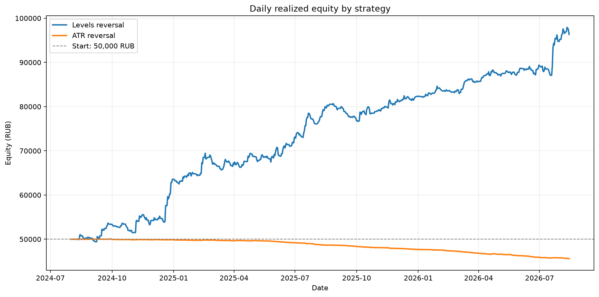
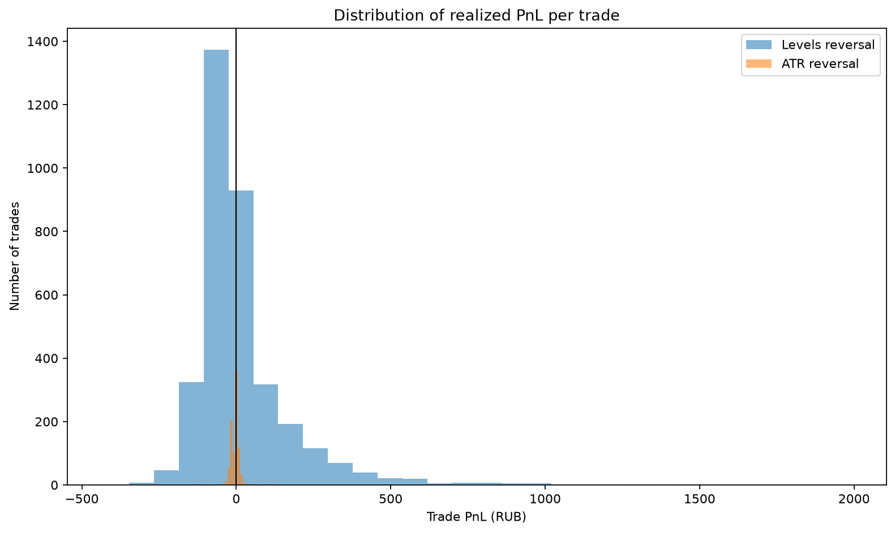
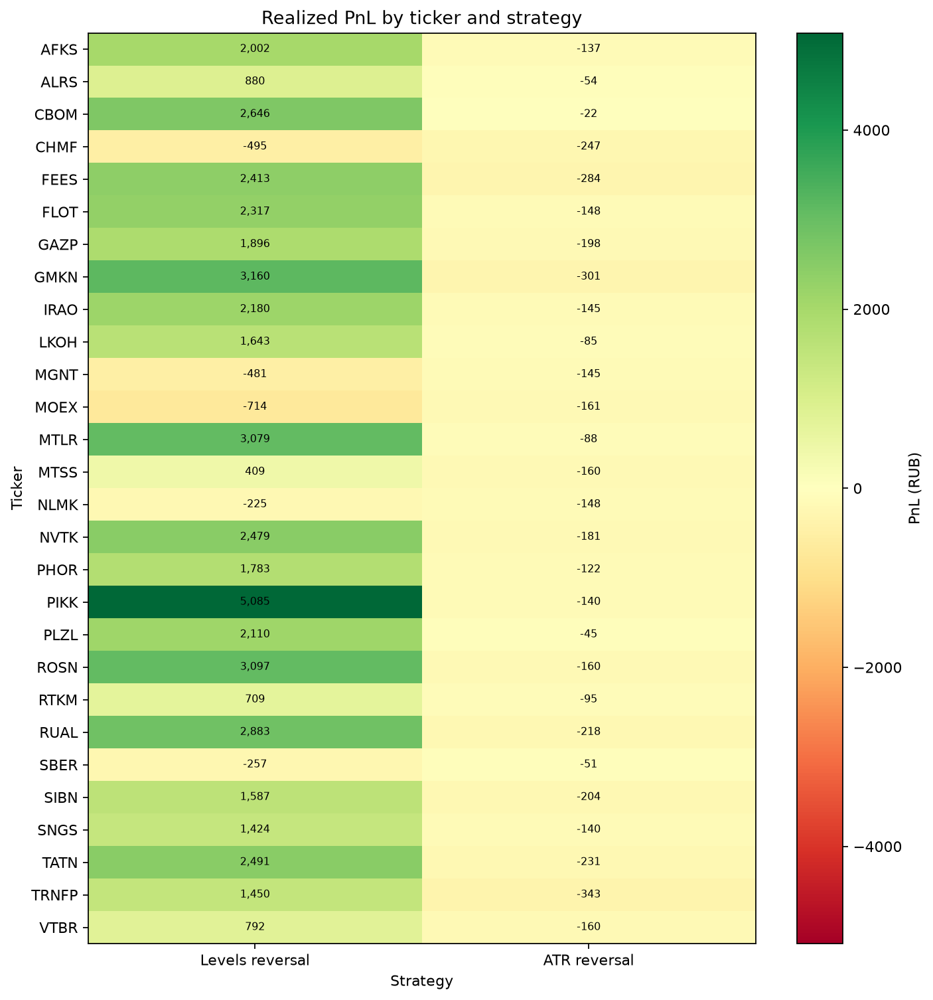
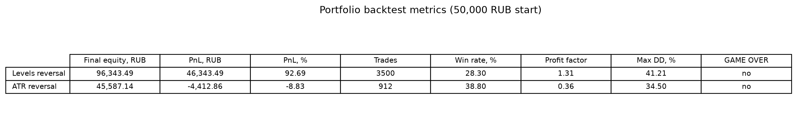

# Issue #44: levels_reversal vs ATR reversal

## Резюме

На фиксированном портфеле 50,000 RUB лучший итог показала **Levels reversal**:
её PnL выше на 50,756.35 RUB.
Это сравнение является историческим бэктестом и не доказывает будущую доходность.

## Методика

- Период: `2024-08-01` — `2026-08-15`.
- Общий капитал: 50,000 RUB; слот: 10,000 RUB; максимум 5 позиций.
- Комиссия включена в `net_return_pct` симулятора.
- Equity по дням реконструирована по закрытым сделкам (realized PnL), без mark-to-market
  открытых позиций.
- Одинаковый порядок тикеров и правила конкуренции за слот применены к обеим стратегиям.

## Сравнительные метрики

| Стратегия | Итоговый equity, RUB | PnL, RUB | PnL, % | Сделки | Win rate | Profit factor | Max DD | GAME OVER |
|---|---:|---:|---:|---:|---:|---:|---:|:---:|
| Levels reversal | 96,343.49 | +46,343.49 | +92.69% | 3500 | 28.3% | 1.31 | 41.21% | нет |
| ATR reversal | 45,587.14 | -4,412.86 | -8.83% | 912 | 38.8% | 0.36 | 34.50% | нет |

## Анализ сделок и тикеров

### Лучшие и худшие тикеры

- **Levels reversal, больше всего сделок:** CBOM (242 сделок), FLOT (223 сделок), PHOR (199 сделок), IRAO (153 сделок), MOEX (148 сделок).
- **ATR reversal, больше всего сделок:** FLOT (55 сделок), TRNFP (44 сделок), MOEX (42 сделок), RUAL (42 сделок), GMKN (41 сделок).
- **Levels reversal, прибыльные:** PIKK (+5,085 RUB, 114 сделок), GMKN (+3,160 RUB, 89 сделок), ROSN (+3,097 RUB, 139 сделок), MTLR (+3,079 RUB, 86 сделок), RUAL (+2,883 RUB, 99 сделок).
- **Levels reversal, убыточные:** MOEX (-714 RUB, 148 сделок), CHMF (-495 RUB, 89 сделок), MGNT (-481 RUB, 100 сделок), SBER (-257 RUB, 135 сделок), NLMK (-225 RUB, 99 сделок).
- **ATR reversal, прибыльные:** нет тикеров минимум с 3 сделками.
- **ATR reversal, убыточные:** TRNFP (-343 RUB, 44 сделок), GMKN (-301 RUB, 41 сделок), FEES (-284 RUB, 40 сделок), CHMF (-247 RUB, 30 сделок), TATN (-231 RUB, 32 сделок).

## Анализ по месяцам

- **Levels reversal:** прибыльные месяцы — 2024-08, 2024-09, 2024-11, 2024-12, 2025-01, 2025-02, 2025-03, 2025-04, 2025-05, 2025-06, 2025-07, 2025-08, 2025-10, 2025-11, 2025-12, 2026-01, 2026-03, 2026-04, 2026-05, 2026-06, 2026-07, 2026-08; убыточные — 2024-10, 2025-09, 2026-02.
- **ATR reversal:** прибыльные месяцы — 2024-08, 2024-09, 2024-12, 2025-02, 2025-04; убыточные — 2024-10, 2024-11, 2025-01, 2025-03, 2025-05, 2025-06, 2025-07, 2025-08, 2025-09, 2025-10, 2025-11, 2025-12, 2026-01, 2026-02, 2026-03, 2026-04, 2026-05, 2026-06, 2026-07, 2026-08.

## GAME OVER

- **Levels reversal:** GAME OVER не наступил.
- **ATR reversal:** GAME OVER не наступил.

## Рекомендации

- **Levels reversal:** допустим только ограниченный forward paper trading; реальный капитал не рекомендован при историческом max DD 41.21%.
- **ATR reversal:** запуск не рекомендован до положительного walk-forward результата.

1. Для paper trading использовать только стратегию с положительным PnL, PF > 1,
   минимум 30 сделками и без GAME OVER; ограничить размер позиции и задать stop-критерий
   по drawdown.
2. Для ATR reversal прогнать walk-forward сетку:
   `atr_completion=0.75..0.95`, `volume_spike_mult=1.5..2.5`,
   `stop_atr_mult=0.75..1.25`, `take_atr_mult=0.85..1.50`.
3. Тикерные фильтры строить только на in-sample части и подтверждать на следующем
   временном окне; не исключать тикеры по этому full-sample результату напрямую.
4. Следующая итерация должна добавить mark-to-market equity и сравнение с buy-and-hold,
   чтобы drawdown учитывал открытые позиции.

## Воспроизводимость

- `levels_reversal` SHA-256: `757f80ed7825d097f5a19c04f31a33b8ca2e4cdc174b7cf89c07a322493d6004`
- `atr_reversal` SHA-256: `dc2a67c5ac6c5f88c7f2c6630e62d95441ddc54dd2fcba126e6fd9a912156b44`
- Код расчётов: `analysis.py`; интерактивный walkthrough: `analysis.ipynb`.

